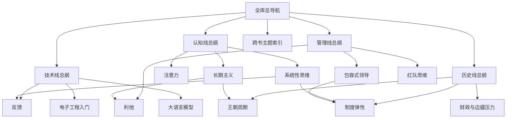

# 全库总导航

## 这张总导航怎么用

这张页是整个阅读库的总入口。

如果把当前库里的内容压缩来看，它已经不只是“几本书的笔记”，而是四条主线共同组成的一张知识地图：

- 认知线：心智如何升级
- 技术线：系统如何工作
- 管理线：人和组织如何打胜仗
- 历史线：王朝和制度如何运行、失衡与修复

## 全库总图

## 四条主线各在解决什么问题

### [[认知线总纲]]

这一条线主要在训练：

- 如何管住注意力
- 如何建立判断结构
- 如何在长周期里积累
- 如何面对复杂问题与意义追问

### [[技术线总纲]]

这一条线主要在训练：

- 如何理解系统由什么组成
- 如何建立工程直觉
- 如何从模拟电路一路过渡到 AI 系统理解

### [[管理线总纲]]

这一条线主要在训练：

- 如何修己
- 如何带队
- 如何形成组织协同
- 如何让组织有稳定打胜仗能力

### [[历史线总纲]]

这一条线主要在训练：

- 如何看王朝建立与强盛
- 如何识别制度代价
- 如何理解危机累积与修复深度

历史主入口补充：

- [[中国历代政权承续总长图]]
- [[历代中枢权力类型总览]]

## 推荐入口

### 如果你今天只想开始读

1. [[欢迎]]
2. [[全库总导航]]
3. 按兴趣进入四条主线之一

### 如果你想先搭框架

1. [[全库总导航]]
2. [[跨书主题索引]]
3. [[认知线总纲]]
4. [[历史线总纲]]

### 如果你想从一本书进入

- 认知方向：[[认知红利-读书笔记]]
- 技术方向：[[全彩图解电子工程师入门手册-读书笔记]]
- 管理方向：[[活法-读书笔记]]
- 历史方向：[[二十四史-读书笔记]]

## 一周复习路径

### 周一：认知

- 读 [[认知线总纲]]
- 重看 1 张基础卡：[[注意力]] 或 [[元认知]]
- 重看 1 张结构卡：[[系统性思维]] 或 [[结构化思维]]

### 周二：技术

- 读 [[技术线总纲]]
- 重看 1 张工程卡：[[电子工程入门]] 或 [[模拟电子技术]]
- 重看 1 张系统卡：[[反馈]] 或 [[Transformer]]

### 周三：管理

- 读 [[管理线总纲]]
- 重看 1 张价值卡：[[利他]] 或 [[敬天爱人]]
- 重看 1 张组织卡：[[包容式领导]] 或 [[红队思维]]

### 周四：历史

- 读 [[历史线总纲]]
- 重看 1 张演化卡：[[王朝周期]] 或 [[开国整合]]
- 重看 1 张制度卡：[[制度弹性]] 或 [[财政与边疆压力]]

### 周五：跨书连接

- 读 [[跨书主题索引]]
- 找 1 个主题，至少连通两条主线

### 周末：自由复盘

- 补一条读后感
- 更新一张概念卡
- 给一条旧笔记加互链

## 我最建议长期坚持的三个动作

1. 每次新增读书笔记时，顺手把它接回主线总纲。
2. 每周至少重看一张旧概念卡，而不是只读新内容。
3. 每月主动补一次跨线连接，让认知、技术、管理、历史互相发光。

## 关联入口

- [[欢迎]]
- [[认知类阅读索引]]
- [[技术学习阅读索引]]
- [[管理与商业阅读索引]]
- [[历史阅读索引]]
- [[跨书主题索引]]

## 一句话

全库总导航的意义，是把这套阅读库从“很多笔记”真正变成“一张可反复进入、可长期升级的知识网络”。
