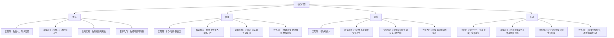

# 做人修身意义行动-跨书对照图

总入口：

- [[跨书主题索引]]
- [[认知线总纲]]
- [[王阳明心学知识地图]]

## 这张图怎么用

这张页不是按书名罗列内容，而是把几本书放在同一组问题上对照：

- 人该先把什么放在中心
- 修身到底是修什么
- 意义和价值从哪里来
- 知道之后，如何真正进入行动

这张图目前先串四本：

- [[做人：王阳明心学的真正传习-读书笔记]]
- [[活法-读书笔记]]
- [[认知红利-读书笔记]]
- [[哲学入门课14天突破哲学大门-读书笔记]]

如果以后再补这条线的新书，这张页可以继续往外扩。

## 跨书总图

## 四本书在讲什么

### 1. 《做人》：把“成为什么样的人”放回一切事情之前

这本书最强的地方，是它不断把人从外部位置、外部评价、外部收益拉回来，追问更根的问题：

- 我到底想成为什么样的人
- 我是不是把做人这件事坐实了
- 我知不知道自己真正该守住什么

它的关键词更偏：

- [[立志]]
- [[本心]]
- [[私欲]]
- [[致良知]]
- [[知行合一]]
- [[担当]]

它提供的是一套“人格工夫”。

### 2. 《活法》：把修身、利他和经营人生连在一起

如果说《做人》更强调心学工夫，那么《活法》更强调把修身放到现实人生和经营实践里。

它最强的地方，不只是讲道理，而是把这些道理拉进：

- 工作怎么做
- 关系怎么处
- 事业怎么走
- 人怎样在现实中不丢正道

它的关键词更偏：

- [[利他]]
- [[敬天爱人]]
- 长期磨炼
- 正道经营

它提供的是一套“现实中的修身伦理”。

### 3. 《认知红利》：把修身翻译成认知系统升级

这本书和前两本气质很不一样。它更少直接谈“心性”，更多是在说：

- 你的注意力投向什么
- 你的认知系统处在什么版本
- 你有没有在做产生复利的事

它不像心学那样直接追问“善与本心”，但它非常适合解释现代人的另一种失守：

- 不是不知道道理
- 而是注意力碎了
- 结构乱了
- 生活被低质量刺激和短期反馈牵着走

它的关键词更偏：

- [[注意力]]
- [[元认知]]
- [[复利]]
- [[长期主义]]

它提供的是一套“现代生活里的认知修炼”。

### 4. 《哲学入门课》：把一切答案重新放回问题里

这本书最不像“指导手册”，但它很重要，因为它提醒我：

- 你以为自己知道的，未必真的被论证过
- 你以为自己在坚持原则，可能只是跟着直觉跑
- 你以为问题很清楚，其实概念都还没说清

它不会直接告诉我如何做人，但它会不断拆掉那些过早的自信。

它的关键词更偏：

- [[哲学思考]]
- [[伦理学]]
- [[怀疑论]]
- [[生命的意义]]

它提供的是一套“问题意识与论证训练”。

## 四条共通主线

### 1. 它们都在反对“只顾外部结果”

- 《做人》反对只求位置
- 《活法》反对只算得失
- 《认知红利》反对只看即时收益
- 《哲学入门课》反对只接受未经检验的现成答案

这四本书语言不同，但都在提醒：人不能只被眼前外部结果牵着走。

### 2. 它们都要求先处理“自己”

- 王阳明处理的是本心、私欲和良知
- 稻盛和夫处理的是欲望、利他和正道
- 《认知红利》处理的是注意力、认知结构和长期积累
- 哲学入门处理的是直觉、前提和论证漏洞

也就是说，它们都不是先改世界，而是先把自己这台系统看清一点。

### 3. 它们都不满足于“知道”

- 《做人》要 [[知行合一]]
- 《活法》要把道理落在工作与做人上
- 《认知红利》要把概念变成生活结构
- 《哲学入门课》至少要求你别在问题都没问清时仓促下结论

它们都在追问：你说你知道，那你活出来了吗？

### 4. 它们最后都回到“我该怎么活”

哪怕入口差异很大，这四本书最后都会落到同一个问题：

- 我该把什么放在中心
- 我该如何对待自己
- 我该如何对待他人
- 我该如何在现实里行动

## 四本书的主要差异

### 差异一：起点不同

- 《做人》从心学和人格起步
- 《活法》从人生经营与伦理起步
- 《认知红利》从现代认知升级起步
- 《哲学入门课》从提问和怀疑起步

### 差异二：语言系统不同

- 《做人》更像修身工夫书
- 《活法》更像人生经营书
- 《认知红利》更像认知方法书
- 《哲学入门课》更像思辨训练书

### 差异三：最擅长解决的问题不同

- 《做人》最适合处理“我是不是越来越不像我想成为的人”
- 《活法》最适合处理“现实复杂时，怎么不丢正道”
- 《认知红利》最适合处理“我努力很多，为什么还是低效失焦”
- 《哲学入门课》最适合处理“我到底有没有把问题想清楚”

## 建议对照着读

### 路径一：先把人立住

1. [[做人：王阳明心学的真正传习-读书笔记]]
2. [[王阳明心学知识地图]]
3. [[活法-读书笔记]]

这条路径适合先补人格底盘。

### 路径二：先把脑子理顺

1. [[认知红利-读书笔记]]
2. [[认知线总纲]]
3. [[哲学入门课14天突破哲学大门-读书笔记]]

这条路径适合先补注意力、结构和问题意识。

### 路径三：四本一起围绕同一问题读

如果你最近最关心的是“我该怎么活”，可以按这个顺序来：

1. [[做人：王阳明心学的真正传习-读书笔记]]
2. [[活法-读书笔记]]
3. [[认知红利-读书笔记]]
4. [[哲学入门课14天突破哲学大门-读书笔记]]

这样读会很清楚地看见：

- 王阳明给的是人格骨架
- 稻盛给的是现实中的伦理与经营
- 认知红利给的是现代人的认知升级工具
- 哲学入门给的是持续追问和检视的能力

## 关联入口

- [[王阳明心学知识地图]]
- [[认知线总纲]]
- [[跨书主题索引]]
- [[利他]]
- [[敬天爱人]]
- [[注意力]]
- [[元认知]]
- [[哲学思考]]
- [[知行合一]]

## 一句话

把这四本书放在一起看，更容易明白：真正深的读书，不是多收几套说法，而是慢慢长出一套更稳的做人、修身、意义与行动结构。
