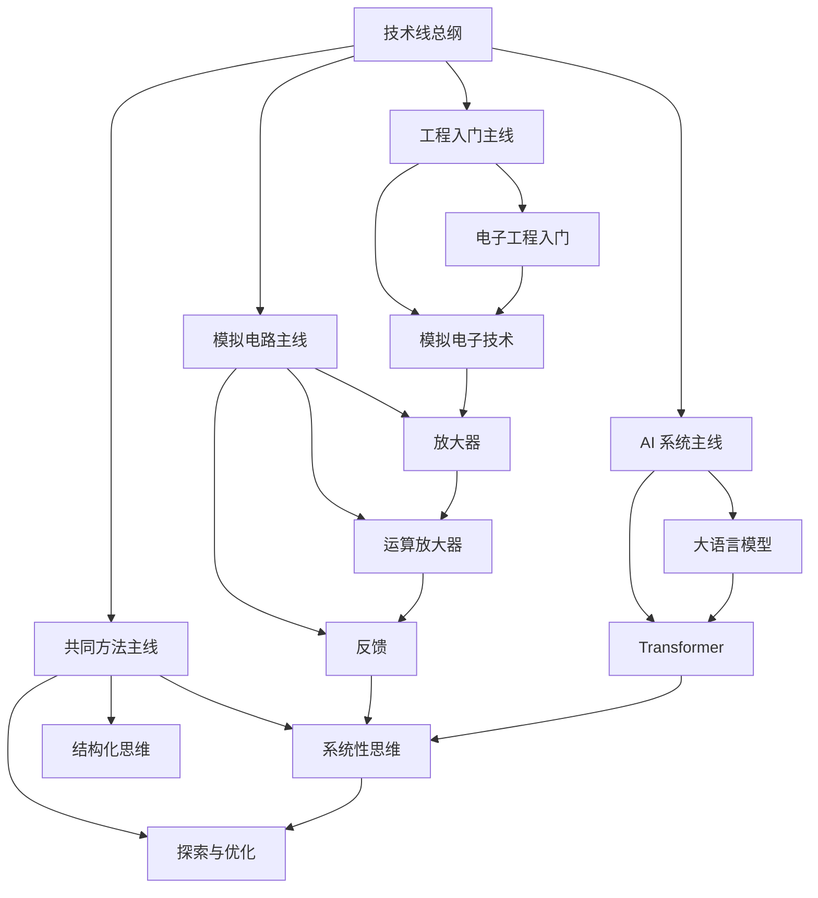

# 技术线总纲

## 这张总纲怎么用

这条技术线目前并不是“所有技术的大而全地图”，而是一个已经成型的双主线：

- 一条是电子工程与模拟电路
- 一条是大语言模型与 AI 系统理解

它们表面不同，但底层其实都在训练“系统如何工作”的技术直觉。

## 技术总图

## 这条技术线在回答什么问题

这条线现在主要在回答三类问题：

- 一个工程系统是由哪些基本单元构成的
- 信号、放大、反馈和稳定性是怎样相互作用的
- 从电子系统到 AI 系统，人怎样建立对复杂技术对象的直觉

所以它不是单纯地记术语，而是在训练“看系统、拆系统、调系统”的能力。

## 四条核心主线

### 1. 工程直觉主线

适合先看：

- [[电子工程入门]]
- [[模拟电子技术]]

这条线帮我建立最基础的技术感觉：

- 元器件在做什么
- 电路为什么能工作
- 抽象原理和真实系统怎样接上

### 2. 放大与反馈主线

适合先看：

- [[放大器]]
- [[运算放大器]]
- [[反馈]]

这是技术线里目前最成熟的一条局部主线，已经很像一门小课程了。

### 3. 大模型系统主线

适合先看：

- [[大语言模型]]
- [[Transformer]]

这条线更多是在建立对现代 AI 系统结构的基础理解。

### 4. 共通方法主线

适合先看：

- [[系统性思维]]
- [[结构化思维]]
- [[探索与优化]]

它提醒我，技术学习不是死记结论，而是不断在系统、结构、试验和迭代中建立直觉。

## 可以直接照着走的阅读顺序

### 路径一：从电子工程入门

1. [[全彩图解电子工程师入门手册-读书笔记]]
2. [[电子工程入门]]
3. [[模拟电子技术]]

### 路径二：从放大器切入

1. [[你好，放大器初识篇-读书笔记]]
2. [[放大器]]
3. [[运算放大器]]
4. [[反馈]]

### 路径三：从模拟实例切入

1. [[实例解读模拟电子技术完全学习与应用-读书笔记]]
2. [[模拟电子技术]]
3. [[放大器]]
4. [[反馈]]

### 路径四：从大模型切入

1. [[Happy-LLM从零开始的大语言模型原理与实践教程-读书笔记]]
2. [[大语言模型]]
3. [[Transformer]]

## 这条线和其他主线怎么相连

### 和认知线相连

技术学习很依赖 [[结构化思维]]、[[系统性思维]] 和 [[探索与优化]]。没有这些方法，技术容易学成一堆互不相连的结论。

### 和管理线相连

真正做工程时，技术并不只是一张电路图或一个模型，还涉及协作、取舍、复盘和团队执行，这些都能和管理线打通。

### 和历史线相连

表面上离得远，但底层有共通点：都在训练你观察复杂系统如何在约束中运行、失稳、修复。

## 我最建议长期保留的三个动作

1. 先看系统整体，再看局部元件。
2. 先问输入输出，再问内部细节。
3. 先做可解释的结构理解，再做记忆。

## 关联入口

- [[技术学习阅读索引]]
- [[跨书主题索引]]
- [[全彩图解电子工程师入门手册-读书笔记]]
- [[Happy-LLM从零开始的大语言模型原理与实践教程-读书笔记]]

## 一句话

技术线总纲的意义，是把工程与 AI 这些看似不同的内容，统一到“理解系统如何工作”的学习框架里。
