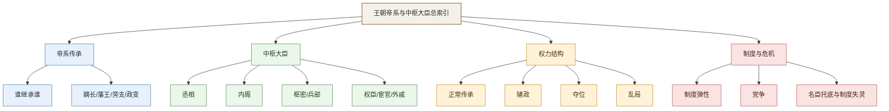

# 王朝帝系与中枢大臣总索引

总入口：

- [[中国历代政权承续总长图]]
- [[历代中枢权力类型总览]]

## 这张索引怎么用

这张页不是单纯列朝代表，而是把历史阅读往“可查、可比、可继续扩”的方向推进一步。

我会把每个朝代尽量拆成六层：

- 帝系传承：皇位如何从上一代传到下一代
- 中枢大臣：当朝真正影响决策和秩序的人有哪些
- 权力结构：是正常传承、强臣辅政、外戚干政、宦官专权，还是战乱中的非常传位
- 继承断点：哪一次传位最关键、最不正常、最能暴露制度问题
- 制度代价：这个王朝最强的制度，最后是怎样反过来压垮自己的
- 正史回查：至少能指回哪几部本纪、列传或纪传节点继续深读

## 总图

## 颜色图例

- 蓝色：帝系传承主线，重点看“谁继承谁”
- 绿色：中枢人物与整合力量，重点看“谁在托底”
- 橙色：权力结构与接管方式，重点看“怎么夺、怎么辅、怎么乱”
- 红色：制度危机与结构代价，重点看“为什么会失衡”

后面具体朝代表中的颜色，会尽量沿着这个思路统一：

- 同一政权内部主线，用同色系表示连续性
- 并立政权，用不同色系表示并行性
- 统一节点或改朝接管节点，优先用绿色突出“结构转折”

## 当前已实装

- [[中国历代政权承续总长图]]
- [[历代中枢权力类型总览]]
- [[夏商周总览表]]
- [[夏朝帝系表]]
- [[商朝帝系表]]
- [[周朝帝系表]]
- [[秦朝帝系表]]
- [[西汉帝系表]]
- [[东汉帝系表]]
- [[三国帝系总表]]
- [[晋朝帝系表]]
- [[南北朝帝系总表]]
- [[魏晋南北朝承续与权力结构图]]
- [[隋朝帝系表]]
- [[唐朝帝系表]]
- [[隋唐承续与藩镇宦官中枢结构图]]
- [[五代十国帝系总表]]
- [[宋朝帝系总表]]
- [[辽朝帝系表]]
- [[金朝帝系表]]
- [[元朝帝系表]]
- [[宋辽金元承续与多政权并立结构图]]
- [[明朝帝系与中枢大臣表]]
- [[清朝帝系表]]
- [[民国政权承续表]]

## 上古至二十四史扩展清单

| 朝代 | 对应文献 | 时间范围 | 重点可拆主题 | 当前状态 |
|---|---|---|---|---|
| 夏 | 《史记·夏本纪》等 | 约前21世纪-前16世纪 | 禅让到家天下、太康失国、少康中兴、夏亡 | 已完成第一版 |
| 商 | 《史记·殷本纪》等 | 约前16世纪-前11世纪 | 迁都、王权神权、伊尹、武丁中兴 | 已完成第一版 |
| 周 | 《史记·周本纪》等 | 约前11世纪-前256 | 分封、宗法、东周裂解 | 已完成第一版 |

## 二十四史朝代扩展清单

| 朝代 | 对应正史 | 时间范围 | 重点可拆主题 | 当前状态 |
|---|---|---|---|---|
| 西汉 | 《史记》《汉书》 | 前202-8/9 | 开国整合、外戚、王莽前夜 | 已完成第一版 |
| 东汉 | 《后汉书》 | 25-220 | 外戚宦官、党锢、地方豪强 | 已完成第一版 |
| 三国 | 《三国志》 | 220-280 | 曹魏禅代、蜀汉继统、孙吴地方化 | 已完成总表第一版 |
| 晋 | 《晋书》 | 266-420 | 宗室、门阀、八王之乱 | 已完成第一版 |
| 南北朝 | 《宋书》至《北史》 | 420-589 | 皇权更替频密、门阀与军权 | 已完成总表第一版 |
| 隋 | 《隋书》 | 581-618 | 二世而亡、制度高效与高压代价 | 已完成第一版 |
| 唐 | 《旧唐书》《新唐书》 | 618-907 | 贞观、开元、藩镇、宦官 | 已完成第一版 |
| 五代 | 《旧五代史》《新五代史》 | 907-960 | 军人政治、快速更替 | 已完成总表第一版 |
| 宋 | 《宋史》 | 960-1279 | 文官体系、边疆财政压力 | 已完成总表第一版 |
| 辽金元 | 《辽史》《金史》《元史》 | 907-1368 | 多元统治、部族与皇权结合 | 已完成第一版 |
| 明 | 《明史》 | 1368-1644 | 皇权、内阁、宦官、党争、边患 | 已完成第一版 |

## 帝制终局补充

| 朝代/时期 | 对应文献 | 时间范围 | 重点可拆主题 | 当前状态 |
|---|---|---|---|---|
| 清 | 《清史稿》等 | 1636/1644-1912 | 八旗、军机处、晚清危机、帝制终结 | 已完成第一版 |
| 民国 | 近现代史料 | 1912-1949（大陆政权主线） | 共和重建、北洋更替、国民政府、帝制后秩序 | 已完成总表第一版 |

## 先秦到帝制转折补充

| 朝代 | 对应文献 | 时间范围 | 重点可拆主题 | 当前状态 |
|---|---|---|---|---|
| 秦 | 《史记·秦始皇本纪》等 | 前221-前207 | 皇帝制确立、郡县制、继承失序、二世而亡 | 已完成第一版 |

## 深读版模板

后续每个朝代的详细表，我会尽量按这个结构统一，而不是只停在“皇帝名单”：

| 皇帝 | 在位时间 | 继位来源 | 传位去向 | 关键中枢大臣/权臣 | 权力结构备注 |
|---|---|---|---|---|---|
| 示例 | 0000-0000 | 嫡长继承/叔夺侄位/政变即位 | 传子/传弟/亡国 | 某某、某某 | 正常传承/辅政/内斗/危机 |

每张成熟页还应继续包含：

- 一张帝系主线图
- 3 到 5 个最值得深看的继承断点
- 一组关键中枢人物的分类阅读
- 一组“正史回查锚点”
- 若适用，再补制度代价、边疆压力、党争、名臣托底等配套主题链接

## 当前深度状态说明

- 已较深入：[[夏朝帝系表]]、[[明朝帝系与中枢大臣表]]
- 已升级为深读版：[[唐朝帝系表]]、[[隋朝帝系表]]、[[五代十国帝系总表]]、[[晋朝帝系表]]、[[南北朝帝系总表]]、[[辽朝帝系表]]、[[金朝帝系表]]、[[元朝帝系表]]、[[清朝帝系表]]、[[民国政权承续表]]
- 仍需继续升级：[[三国帝系总表]]、[[宋朝帝系总表]] 等

## 最值得一起看的配套卡片

- [[王朝周期]]
- [[开国整合]]
- [[集权与官僚体系]]
- [[党争]]
- [[财政与边疆压力]]
- [[名臣托底与制度失灵]]
- [[制度弹性]]

## 一句话

帝系和大臣名单本身不是目的，真正有价值的是借它们看清一个王朝的权力是如何传递、被谁实际支撑、又怎样逐渐失衡的。
