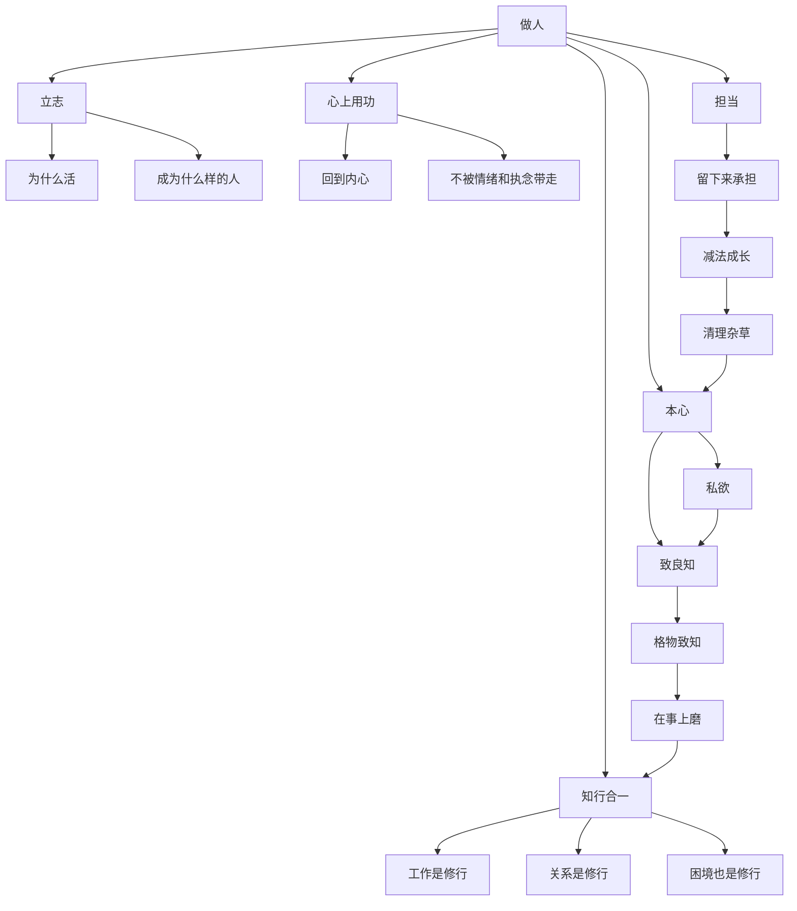

# 王阳明心学知识地图

总入口：

- [[认知线总纲]]
- [[认知类阅读索引]]
- [[做人：王阳明心学的真正传习-读书笔记]]

## 这张图怎么用

这张页不是重复《做人》的读后感，而是把这本书已经拆出来的概念卡，重新整理成一张能“从总到分、从义理到行动”的主地图。

如果只想快速把握骨架，先看总图。

如果想系统重读，建议按后面的三层路径走：

- 先看“起点层”：人为什么先要回到做人和立志
- 再看“工夫层”：本心、私欲、致良知、格物致知、心上用功
- 最后看“落实层”：在事上磨、知行合一、担当、减法成长

## 王阳明心学总图

## 一眼看懂这张图的三层结构

### 1. 起点层：先把“做人”放回中心

这一层解决的不是技巧问题，而是方向问题。

- [[立志]]：先回答“我想成为什么样的人”，而不是急着求位置。
- [[做人：王阳明心学的真正传习-读书笔记]]：整本书都在把“做人”从道德口号，重新变成一切事情的根。

如果这一层没站稳，后面的学习、努力、方法，都会很容易滑向工具主义。

### 2. 工夫层：真正的修炼大多发生在心上

这一层是整张图的中段，也是最需要反复重读的部分。

- [[本心]]：先找到内在较清明的那个位置。
- [[私欲]]：看清什么东西在不断把人往自我中心和失真判断那边拉。
- [[致良知]]：承认自己其实知道什么是对的，然后把它护住。
- [[格物致知]]：不是只研究外物，而是在具体事情里照见自己、修正自己。
- [[心上用功]]：很多真正的功夫，不在外面表演，而在内在校正。

如果压缩成一句话，这一层就是：把心里的遮蔽物一点点清掉，让人重新能看见、承认并守住更正的判断。

### 3. 落实层：心学不是讲明白，而是活出来

这一层专门回答一个问题：工夫最后怎么进入现实。

- [[在事上磨]]：事情不是干扰项，事情本身就是道场。
- [[知行合一]]：如果知道始终不能进入行动，那个知道往往还不算真知道。
- [[担当]]：碰到复杂现实，不只是表态，而是愿意承担。
- [[减法成长]]：成长不只靠增加，还靠清理那些拖住自己的东西。

这一层也解释了为什么王阳明心学会让人感觉“既高，又硬”：它不是让人更会说，而是让人更难逃。

## 这 10 张卡之间最关键的关系

### 关系一：立志决定方向

没有 [[立志]]，后面的修身很容易变成“为了更高效、更成功、更会赢”的工具训练。

### 关系二：本心和私欲决定你能不能听见良知

[[本心]] 像内在基准，[[私欲]] 像遮蔽物，[[致良知]] 则是在两者拉扯中，尽量让更清明的判断显出来。

### 关系三：格物致知和在事上磨决定工夫会不会落空

如果没有 [[格物致知]] 和 [[在事上磨]]，心学很容易只剩漂亮术语；一旦放回现实，它才开始有分量。

### 关系四：知行合一和担当决定人格是否站得住

很多人不是不知道，而是不肯做；不是不会说，而是不肯扛。[[知行合一]] 和 [[担当]] 恰恰就是卡住这种“聪明但空心”的两道关。

## 建议重读顺序

### 路径一：先抓最大主线

1. [[做人：王阳明心学的真正传习-读书笔记]]
2. [[王阳明心学知识地图]]
3. [[立志]]
4. [[知行合一]]
5. [[担当]]

### 路径二：先补心学工夫

1. [[本心]]
2. [[私欲]]
3. [[致良知]]
4. [[格物致知]]
5. [[心上用功]]
6. [[在事上磨]]

### 路径三：和其他书交叉着读

1. [[做人：王阳明心学的真正传习-读书笔记]]
2. [[活法-读书笔记]]
3. [[认知红利-读书笔记]]
4. [[哲学入门课14天突破哲学大门-读书笔记]]

这样读会更容易看见：

- 王阳明这条线如何补“认知工具”之外的心性基础
- 它如何和利他、长期主义、意义追问互相咬合

## 最适合反复回看的原书位置

- `PDF p16`：做人和做官、主一与逐物
- `PDF p29`：格物致知的关键分歧
- `PDF p59`：龙场处境与胸中气象
- `PDF p87`：不要错过自己的心
- `PDF p102`：私欲、生死之念与去蔽
- `PDF p167`：留下来承担
- `PDF p181`：修身如何进入现实治理

## 关联入口

- [[做人：王阳明心学的真正传习-行动清单与金句摘录]]
- [[跨书主题索引]]
- [[立志]]
- [[本心]]
- [[私欲]]
- [[致良知]]
- [[格物致知]]
- [[心上用功]]
- [[在事上磨]]
- [[知行合一]]
- [[担当]]
- [[减法成长]]

## 一句话

把《做人》拆成一张知识地图后，更容易看见的不是“心学名词”，而是一整套从立志、修心到行动、担当的人格工夫。
