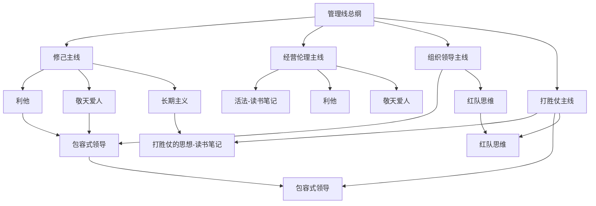

# 管理线总纲

## 这张总纲怎么用

这条管理线目前的材料不算最多，但骨架已经很清楚了：

- 从修己开始
- 走到带队
- 再走到组织如何形成打胜仗能力

所以这张页会把个人心性、经营伦理、领导方式和组织机制串成一张连续地图。

## 管理总图

## 这条管理线在回答什么问题

这条线现在集中回答的是：

- 一个人应该用怎样的原则做事
- 一个领导者怎样把价值观变成团队秩序
- 一个组织怎样减少内耗、形成协同、提升胜率

所以它不是“励志”和“鸡血”的合集，而是在问：

- 什么样的人能带出什么样的组织
- 什么样的组织才能稳定打胜仗

## 四条核心主线

### 1. 修己主线

适合先看：

- [[利他]]
- [[敬天爱人]]
- [[长期主义]]

这条线强调的是，管理不是先学技巧，而是先建立做事的底层取向。

### 2. 经营伦理主线

适合先看：

- [[活法-读书笔记]]
- [[利他]]
- [[敬天爱人]]

它让“做人”和“经营”不是两回事，而是同一套底层原则的不同展开。

### 3. 组织领导主线

适合先看：

- [[包容式领导]]
- [[红队思维]]

这条线更偏组织内部：

- 怎样带人
- 怎样容纳不同意见
- 怎样避免集体盲点

### 4. 打胜仗主线

适合先看：

- [[打胜仗的思想-读书笔记]]
- [[包容式领导]]
- [[红队思维]]

这条线把管理从“价值观正确”推进到“组织真的能打”。

## 可以直接照着走的阅读顺序

### 路径一：从个人修炼进入

1. [[活法-读书笔记]]
2. [[利他]]
3. [[敬天爱人]]
4. [[长期主义]]

### 路径二：从团队带领进入

1. [[包容式领导]]
2. [[红队思维]]
3. [[打胜仗的思想-读书笔记]]

### 路径三：从组织获胜进入

1. [[打胜仗的思想-读书笔记]]
2. [[包容式领导]]
3. [[红队思维]]
4. [[长期主义]]

## 这条线和其他主线怎么相连

### 和认知线相连

管理很大一部分其实是认知问题：

- 领导者如何判断
- 团队如何形成共识
- 组织如何避免盲点

所以 [[结构化思维]]、[[系统性思维]]、[[元认知]] 都能反向支持管理。

### 和历史线相连

历史里的 [[党争]]、[[名臣托底与制度失灵]]、[[集权与官僚体系]]，其实都是非常好的组织管理反面教材或大样本案例。

### 和技术线相连

做技术最终会走到协作、分工、复盘、取舍和交付，管理线提供的是这些技术工作背后的组织语言。

## 我最建议长期保留的三个动作

1. 先看人，再看事，再看机制。
2. 先建信任和原则，再谈执行和速度。
3. 先让组织能听见不同意见，再要求它快速统一。

## 关联入口

- [[管理与商业阅读索引]]
- [[跨书主题索引]]
- [[活法-读书笔记]]
- [[打胜仗的思想-读书笔记]]

## 一句话

管理线总纲的意义，是把“修己、带队、建组织、打胜仗”整理成一条连续而不割裂的成长路线。
