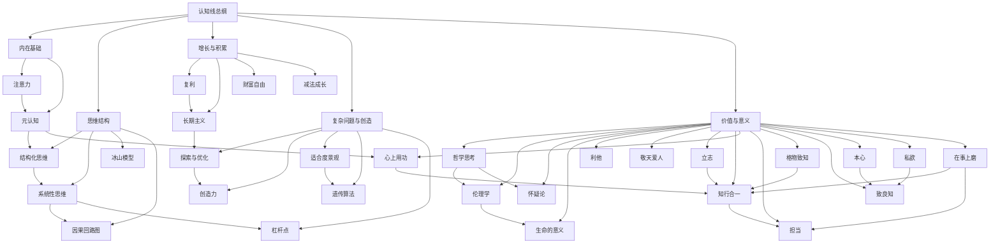

# 认知线总纲

## 这张总纲怎么用

这张页的目标，不是把认知类笔记重新列一遍，而是把它们整理成一张“从内在状态到复杂判断”的知识地图。

如果你想先知道这条线在训练什么，先看总图。

如果你想直接进入某个问题，比如注意力、长期成长、复杂问题、创造力或意义追问，可以顺着后面的阅读路径走。

## 认知总图

## 这条认知线在回答什么问题

如果压缩成一句话，这条线在回答的是：

- 人怎样管理自己的注意力与心智资源
- 人怎样建立更稳定的判断结构
- 人怎样在长周期里积累能力和结果
- 人怎样面对复杂问题、创新和意义追问

所以它不是零散的“方法论集锦”，而是一条从“管自己”到“想明白问题”的升级路径。

## 五条核心主线

### 1. 内在状态主线

适合先看：

- [[注意力]]
- [[元认知]]

这条线解决的是一个很基础的问题：

- 在谈复杂思维之前，我有没有先把自己的注意力和观察能力管住

### 2. 判断结构主线

适合先看：

- [[结构化思维]]
- [[系统性思维]]
- [[冰山模型]]
- [[因果回路图]]

这条线帮助我从“有想法”进入“有结构的想法”。

### 3. 长期积累主线

适合先看：

- [[复利]]
- [[长期主义]]
- [[财富自由]]
- [[减法成长]]

这条线最重要的训练是：

- 不只盯短期反馈
- 学会看长期积累和延迟回报

### 4. 复杂问题与创造主线

适合先看：

- [[探索与优化]]
- [[创造力]]
- [[适合度景观]]
- [[遗传算法]]
- [[杠杆点]]

这一条线把“问题求解”和“创新突破”放在一起，帮助我从线性优化走向更灵活的试探、组合和迭代。

### 5. 价值与意义主线

适合先看：

- [[哲学思考]]
- [[伦理学]]
- [[怀疑论]]
- [[生命的意义]]
- [[立志]]
- [[格物致知]]
- [[致良知]]
- [[知行合一]]
- [[心上用功]]
- [[本心]]
- [[私欲]]
- [[在事上磨]]
- [[担当]]
- [[利他]]
- [[敬天爱人]]

这条线的价值在于，认知训练如果只有技巧，没有价值锚点，很容易滑向聪明但空心。

## 可以直接照着走的阅读顺序

### 路径一：从个人状态进入

1. [[认知红利-读书笔记]]
2. [[注意力]]
3. [[元认知]]
4. [[结构化思维]]

### 路径二：从复杂问题进入

1. [[如何系统思考-读书笔记]]
2. [[系统性思维]]
3. [[因果回路图]]
4. [[杠杆点]]

### 路径三：从创造与优化进入

1. [[如何解决复杂问题-读书笔记]]
2. [[探索与优化]]
3. [[创造力]]
4. [[适合度景观]]
5. [[遗传算法]]

### 路径四：从人生意义进入

1. [[哲学入门课14天突破哲学大门-读书笔记]]
2. [[哲学思考]]
3. [[伦理学]]
4. [[怀疑论]]
5. [[生命的意义]]

### 路径五：从做人、修身与担当进入

1. [[做人：王阳明心学的真正传习-读书笔记]]
2. [[立志]]
3. [[本心]]
4. [[私欲]]
5. [[致良知]]
6. [[格物致知]]
7. [[心上用功]]
8. [[在事上磨]]
9. [[知行合一]]
10. [[担当]]
11. [[减法成长]]

## 这条线和其他主线怎么相连

### 和历史线相连

[[系统性思维]]、[[长期主义]] 在历史线里有非常强的穿透力，能直接帮助理解王朝兴衰、制度代价和危机累积。

### 和技术线相连

认知线提供的是学习与判断框架，技术线则提供具体系统对象。像 [[反馈]]、[[大语言模型]]、[[Transformer]] 都可以反过来加深对复杂系统的理解。

### 和管理线相连

管理里很多问题，表面上是组织问题，底层其实是注意力分配、判断结构、价值取向和长期主义问题。

## 我最建议长期保留的三个动作

1. 先管状态，再谈判断。
2. 先看结构，再下结论。
3. 先问长期代价，再看短期收益。

## 关联入口

- [[认知类阅读索引]]
- [[跨书主题索引]]
- [[认知红利-读书笔记]]
- [[如何系统思考-读书笔记]]
- [[如何解决复杂问题-读书笔记]]

## 一句话

认知线总纲的意义，是把注意力、判断、成长、创造和意义这些看似分散的话题，整理成一条可长期升级的心智路线。
