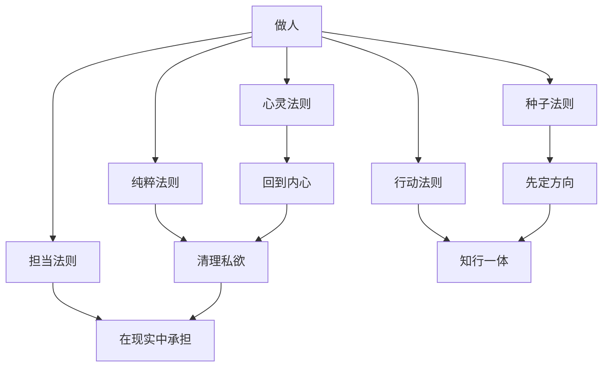

# 《做人：王阳明心学的真正传习》读书笔记

## 关联笔记

- [[做人：王阳明心学的真正传习-行动清单与金句摘录]]
- [[认知线总纲]]
- [[认知类阅读索引]]
- [[系统性思维]]
- [[长期主义]]
- [[哲学思考]]
- [[利他]]
- [[敬天爱人]]

## 一句话总结

这本书最想讲的，不是如何“学会一套王阳明理论”，而是把一个更根本的问题逼到我们面前：人活一生，到底是忙着求外在位置，还是先把“我应该成为怎样的人”这件事坐实。

## 这本书为什么值得认真读

我读下来，它的价值不在于知识新，而在于它把王阳明心学从抽象哲学，拉回到了日常生活：

- 工作怎么做
- 困境怎么扛
- 别人误解时怎么办
- 教育孩子时怎么不失本心
- 面对责任时是逃开还是留下

它真正厉害的地方，是把“成圣”这种看上去很远的词，翻译成了“做人”这种最日常、最现实、也最难持续做好的事。

## 全书主脉络

从目录来看，这本书把内容压成了五条线：

1. 种子法则
2. 心灵法则
3. 纯粹法则
4. 行动法则
5. 担当法则

这五条线放在一起，其实是在回答同一个问题：

- 我为什么活
- 我应该成为什么样的人
- 我该如何在现实里行动
- 我凭什么不被环境带着跑

## 一图速览

## 最打动我的五个核心判断

### 1. 做人，是先抓住最大的那个“核桃”

这本书一开始就不断提醒：人一生最怕的，不是没做事，而是一直在做枝节，却没抓住根本。

书里借王阳明少年立志讲的是：一个人真正要先回答的，不是“我要做什么工作”，而是“我想成为什么样的人”。

这是一个非常大的提醒。因为现代人的焦虑，很多不是来自事情太难，而是来自顺序错了：

- 先找职位，再找意义
- 先迎合环境，再谈本心
- 先算收益，再问自己值不值得

结果就是越努力越空心。

书里有一段我很喜欢：

> 做人这一件事，就像水的源泉，就像树的根。

这句话很朴素，但很重。因为它把“做人”从道德口号，重新变成了所有事情的源头工程。

### 2. 最重要的修行，不在外面，在心上

目录里“凡事要在心上下功夫”这一句，几乎可以看作全书中轴。

它不是让人逃避现实，也不是让人只在心里自我安慰，而是说：真正决定你怎么看世界、怎么受苦、怎么行动、怎么不被击垮的，是内在心力。

书里写王阳明在龙场前后的转变时，尤其能看出这一点。人在外部环境极差的时候，如果心彻底散了，现实就会把人磨碎；但如果心能立住，外部再险，仍有转机。

书中引用王阳明赴龙场途中写的诗：

> 险夷原不滞胸中，何异浮云过太空。

这句特别有力量。它不是说苦难不存在，而是说一个人的胸中如果足够开阔，苦难就不再能完全占据他。

我对这句的理解是：真正的内心修炼，不是让痛苦消失，而是让痛苦不再成为你的全部世界。

### 3. 真正的成长，不是增加很多东西，而是清理杂草

这本书讲“纯粹法则”时，我很受触动。它不是鼓励人拼命往心里塞更多道理，而是反复强调：很多时候，我们本来就知道该怎么做，只是被杂念、私欲、虚荣、恐惧、比较心盖住了。

目录里“你要做的只是清除心中的杂草”“让心成为一面明镜”，都在说这个意思。

这和我以前默认的成长观不一样。以前容易把成长理解成“越多越好”：

- 多学一点
- 多懂一点
- 多掌握一些方法

但这本书提醒我，成长也可以是“减法”：

- 减少自欺
- 减少借口
- 减少被环境牵引
- 减少为了证明自己而做的事

书里还有一段很有分量：

> 任何念头都不要滞留在心体上。

我的体会是，很多人不是能力不够，而是心里留了太多不该留的东西，所以行动变形，判断失真，长期被拖住。

### 4. 知如果不落到行里，就还不算真的知道

“知是行的开始，行是知的结果”这一层，是王阳明最常被提起的话，但这本书写得比较接地气。

它不是抽象地说知行合一，而是不断把它落回生活：

- 工作就是修行
- 教育孩子也是修行
- 面对困境时的反应，也是你真正的认知水平

书里有一句我很喜欢：

> 只有行动才能消解对不确定性的恐惧。

这句话非常适合今天的人。我们很多焦虑，并不是因为现实真的无解，而是因为迟迟不进入行动，所以心里不断放大未知。

我读这部分最大的感受是：很多所谓“没想清楚”，其实不是该继续想，而是该开始做。行动本身会反过来校正认知。

### 5. 拂袖而去很容易，难的是留下来承担

这本书最后最重的一层，是“担当法则”。

它最打动我的，不是豪言壮语，而是它反复在问：一个人碰到肮脏复杂的现实，是不是只能退？

书里写得很明白：

> 拂袖而去很容易，难的是留下来。

这是我觉得全书最有现实力量的地方。很多时候，离开确实轻松，表态也容易，批评环境也容易；真正难的是，在你已经看见问题、受过委屈、知道现实不完美之后，仍然愿意尽你那一份责任。

这让我想到，担当不是热血一阵，而是明知不完美，仍不放弃正道。

## 几段我特别想记住的原文

### 关于做人和做官

> 我们每一个人本来都是好好的甲方……但是，我们偏偏选择了乙方的活法。

这段不是在讲职业身份，而是在讲人生姿态。它提醒我，不要一直追着外部标准跑到最后，忘了自己本来该成为什么样的人。

### 关于切入点

> 意义、目标、行动、切入点，这四个元素把生命坐实，变成实实在在的人生。

这段非常适合反复读。很多人不是没有意义，也不是没有目标，而是没有切入点，所以理想一直落不了地。

### 关于不该错过什么

> 我们最不应该错过的，是我们自己的心。

这句几乎可以作为整本书最核心的提醒。因为我们大多数焦虑，都是不断怕错过外部机会，却一次次错过自己。

### 关于私欲与生死之念

> 学问的功夫，在一切声色名利嗜好上，都能摆脱殆尽，但仍有一种生死的念头牵挂在心里，就不能和整个本体融合一体。

这句让我意识到，真正深的修养，不只是去掉浅层欲望，而是连最深的恐惧都要慢慢照见。

## 回看原书时最值得重读的位置

为了以后重读更高效，我把这次最有分量的几处先钉住。页码以下面这份 PDF 的页码为准：

- `PDF p16`：做人和做官、主一与逐物。这里是全书立意的起点，最能看出作者为什么把“做人”放在一切事情之前。
- `PDF p29`：格物致知的分歧。这里把朱熹、陆九渊、王阳明三条路摆在一起，能帮助我看清王阳明为什么把工夫收到“心上”。
- `PDF p37`：圣人可学而至。这里最适合对冲“心学只是高论”的误解，它在说修身不是天赋特权，而是可以一点点做到的路径。
- `PDF p45`：意义、目标、行动、切入点。这里非常适合反复看，因为它把“理想如何落地”讲得很实。
- `PDF p59`：龙场处境与“险夷原不滞胸中”。这里是理解心力、逆境与胸中气象的关键页。
- `PDF p87`：我们最不应该错过的，是我们自己的心。这里几乎可以当成本书的总提醒。
- `PDF p102`：私欲、生死之念与念头滞留。这里最能看出“清理内心”不是空话，而是极具体的修炼要求。
- `PDF p167`：拂袖而去很容易，难的是留下来。这里把担当从姿态拉回到现实。
- `PDF p181`：两广平乱与官逼民反。这里适合和“知行合一”“担当”一起看，因为它不是纯讲修身，而是讲修身如何进入治理与现实判断。

## 和现有认知线怎么连起来

这本书虽然写的是王阳明，但如果放进整个 Obsidian 库里看，它其实正好补上了认知线里最容易缺的一块：认知之外的心性基础。

- 和 [[认知红利-读书笔记]] 连起来看，它提醒我：认知升级不是只增加模型，还要防止人被效率、收益、位置感牵着跑。
- 和 [[如何系统思考-读书笔记]] 连起来看，它提醒我：系统结构当然重要，但如果系统中的行动者心乱、意偏、责任感不足，再好的结构也会失真。
- 和 [[活法-读书笔记]] 连起来看，会发现它们都在强调“把人先立住”，只是稻盛和夫更偏经营与利他，王阳明这本更偏心性与工夫。
- 和 [[哲学入门课14天突破哲学大门-读书笔记]] 连起来看，它能把抽象哲学问题重新压回日常生活，让“意义”“善”“行动”不只停留在概念层。

如果只看一本，它像修身书；如果放进整条认知线，它更像一个底盘修复器。它不是直接告诉我怎么赢，而是先追问：用什么样的人，去赢；赢了之后，会不会把自己弄丢。

## 我自己的读后体会

这本书让我最受震动的，不是“王阳明很厉害”，而是它把一个更难的问题抛给了我：

- 如果不先解决做人，再多方法是不是都可能变成工具主义？
- 如果心不稳，再好的计划是不是也会在现实里走样？
- 如果没有担当，再高明的认知是不是最后也只是一种自保技巧？

我越来越觉得，这本书表面上在讲王阳明，实际上在讲一种很稀缺的生命结构：

- 有内在方向
- 有心力
- 有自我清理能力
- 有行动力
- 有责任感

这五个东西一旦连在一起，人就不容易被现实轻易打散。

## 这本书最适合解决哪些现实困惑

### 1. 我总在忙，但不知道自己到底在成为什么样的人

这本书会把你从“做很多事”的幻觉里拉出来，逼你回到根本问题。

### 2. 我知道很多道理，但现实里总做不到

它会提醒你，不是道理不够，而是没有把认知变成行动，没有把行动变成习惯。

### 3. 我很容易被环境、情绪、关系拖走

它会不断把你拉回心上，重新建立“内在不失守”的能力。

### 4. 我想做个更好的人，但总觉得现实不允许

它会让你明白，现实当然复杂，但真正难的，不是看清现实，而是在现实里不背叛自己。

## 我想把它落实成的习惯

1. 每周问自己一次：我最近更像是在求位置，还是在做人。
2. 遇到纠结时先问：这件事是不是让我离“应成为的人”更近。
3. 情绪很满时，不急着反应，先回到心上看自己。
4. 少想“我懂了没有”，多问“我今天做了没有”。
5. 面对责任时，少一些漂亮表态，多一些真实承担。

## 最后一句话

《做人：王阳明心学的真正传习》最深的价值，不是教我们学会引用心学术语，而是逼我们回到一个很难逃开的起点：先把“做人”这件事做扎实，其他事情才不会从根上歪掉。
