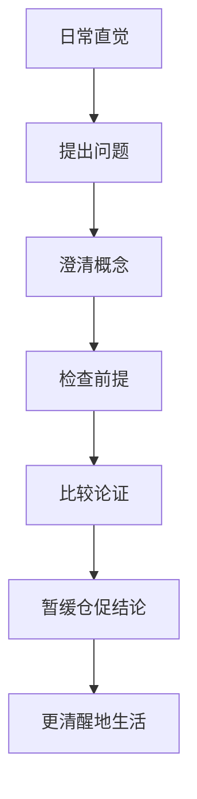

# 《哲学入门课14天突破哲学大门》读书笔记

## 关联笔记

- [[哲学入门课14天突破哲学大门-行动清单与金句摘录]]
- [[哲学思考]]
- [[伦理学]]
- [[怀疑论]]
- [[生命的意义]]

## 一句话总结

这套书最有价值的地方，不是告诉我“标准答案”，而是不断训练我：面对习以为常的问题，先暂停，先怀疑，再把问题问得更清楚。

## 一图速览

## 这本书是什么

这不是一本单一主题的小书，而是一套“哲学入门包”。从目录看，它用大量短问题和思想实验，把哲学拆成多个入口：

- 伦理观：我们该做什么
- 政治与社会：为什么要遵守法律
- 逻辑：道理为什么会打架
- 形而上学：现实到底是什么
- 知识：我们怎么知道自己知道
- 自我：我是谁
- 宗教：上帝、奇迹与信仰
- 美学：艺术的价值是什么
- 价值观：生命的意义是什么

它不是系统教材，更像一张“哲学问题地图”。

如果再往下拆，我会把这套书看成四层训练：

### 第一层：学会提出真正的问题

哲学首先不是给答案，而是把问题问清楚。

### 第二层：学会和直觉保持一点距离

很多问题之所以复杂，不是因为信息不够，而是因为我们的直觉彼此冲突，却平时意识不到。

### 第三层：学会辨认论证

一个观点听起来顺，不等于它真的被论证出来了。

### 第四层：把思辨重新带回生活

哲学不是远离生活，而是让我们更谨慎地生活。

## 最触动我的地方

### 1. 哲学首先不是答案，而是提问方式

前言里有个意思很重要：只要你开始系统、清晰地思考“问题是什么、我们假设了什么、这些假设会把我们带到哪里”，你其实就已经在做哲学了。

这一下把哲学从“高高在上的学科”拉回到了日常生活。哲学不是离生活很远，而是：

- 我为什么认为这是对的？
- 这个判断背后默认了什么？
- 如果把这个原则推到底，会发生什么？

我很喜欢这一点，因为它让哲学不再只是“名家观点收藏”，而是一种可练习的思维动作。

你一旦习惯这样问，很多日常里的理所当然都会开始松动。

### 2. 哲学问题会逼人从直觉退后一步

这本书非常擅长用短情境把人的直觉逼出来，然后立刻让你发现直觉之间彼此冲突。

比如伦理难题会逼我同时看到：

- 自保是否合理
- 利他是否必须
- 结果和动机哪个更重要
- 把别人当作手段为什么令人不安

很多时候，哲学不是让我更快回答，而是让我更诚实地承认：原来我并没有想清楚。

我觉得这是哲学训练里最珍贵的部分：它会把人的自信轻轻拆开。

原来我以为自己立场很清楚，但只是因为我还没有遇到能逼出矛盾的情境。

### 3. 逻辑与悖论的价值，不只是玩脑筋急转弯

书里关于逻辑、悖论、自我指涉的内容让我重新意识到，很多混乱不是因为问题太难，而是因为语言、前提和推理关系没有被看清。

所以哲学训练的一部分，其实是在训练：

- 说清概念
- 区分语境
- 看出矛盾
- 识别含糊与偷换

这和你库里已有的[[结构化思维]]其实高度相通。

我很认同这一点，因为现实里很多争论根本不是价值观分歧，而是：

- 概念没说清
- 语境混了
- 推理跳步了
- 同一个词在不同地方用了不同意思

哲学训练的好处，就是让人慢慢对这种“看似有道理、其实没有立住”的话更敏感。

### 4. 怀疑不是为了否定一切，而是为了逼近更可靠的判断

关于知识、自我、梦境、信念这些部分，最强烈的感受是：[[怀疑论]]并不是让人什么都不信，而是逼我重新检查“我为什么相信”。

这让我更愿意区分：

- 我以为我知道
- 我真的知道
- 我只是碰巧说对了

这点对我很有帮助，因为它把怀疑从一种“抬杠姿态”重新变成一种认知卫生习惯。

### 5. 哲学最终会回到“我该怎么活”

表面上这套书的问题很多很散，从熊、乞丐、上帝、艺术到身份认同，但它们最后都会汇到一个更深的问题上：

- 我该怎样判断
- 我该怎样行动
- 我该成为什么样的人
- [[生命的意义]]到底来自哪里

所以哲学不是远离生活，而是不断回到生活。

我越来越觉得，这是哲学真正动人的地方。

它看上去讨论的东西很抽象，但最后都会逼人回到自己身上。

## 我的读后体会

这套书给我的最大帮助，不是增加了多少结论，而是让我更愿意容忍“没有立刻答案”的状态。

以前很容易把“快点得出结论”当成思考能力强，但哲学提醒我，真正的思考往往需要先把问题停住，先看清其中的张力、矛盾和前提。

它也让我更警惕那种看上去很顺、很有道理、其实没有被好好追问过的话。

更深一点说，这套书让我学会接受“悬而未决”。

以前会本能地觉得，想清楚就应该尽快落到一个结论上；但哲学提醒我，有些问题的成熟，不在于立刻表态，而在于先把问题放在桌上，看清它真正难在哪里。

## 我会怎么再读这套书

以后如果重读，我会带着三条线去看：

1. 哪些问题是在训练概念澄清。
2. 哪些问题是在训练论证与反论证。
3. 哪些问题最后其实都回到了“我该怎么活”。

## 对我最有用的提醒

### 面对问题时

- 先问清楚问题是什么。
- 先看自己默认了哪些前提。
- 先区分直觉、论证和结论。

### 面对观点时

- 不急着站队，先问推理有没有跳步。
- 看到一个漂亮结论时，多问一句：它真的推出了吗？
- 允许自己暂时保留判断。

### 面对生活时

- 别把习惯当真理。
- 别把多数人的意见当答案。
- 别把“有用”误当成“正确”。

## 最后一句话

哲学真正打开的，不只是知识之门，而是一个人重新看待自己、他人和世界的方式。
