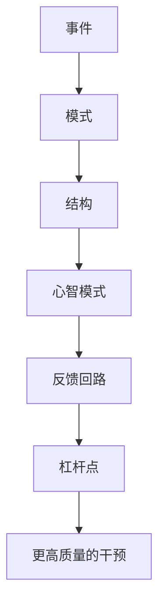

# 《如何系统思考》读书笔记

## 关联笔记

- [[如何系统思考-行动清单与金句摘录]]
- [[系统性思维]]
- [[冰山模型]]
- [[因果回路图]]
- [[结构化思维]]

## 一句话总结

这本书不是单纯谈理念，而是在教人如何把[[系统性思维]]真正落到手上：从看见事件，走向看见模式、结构、反馈回路和杠杆点。

## 一图速览

## 这本书的价值

如果说很多系统思考书籍偏“知道是什么”，这本更偏“具体怎么用”。它把系统思考拆成了可练习的方法链：

- 看系统
- 看动态
- 看全局
- 看反馈
- 找杠杆

它很适合做你的方法论工作台，而不只是概念收藏夹。

如果再拆细一点，我会把这本书理解成一条逐层下潜的路径：

### 第一层：别急着回应表面事件

系统思考的第一步，不是更快给答案，而是先忍住“看到问题立刻处理”的冲动。

很多人一遇到问题就问：

- 谁做错了
- 哪个环节出事了
- 怎么马上补救

这当然不是完全没用，但它很容易把人永远困在救火状态里。

### 第二层：从一次事件，看到反复模式

真正值得警惕的，不是某件事发生了，而是它为什么老发生。

只看单次事件，人容易觉得是偶然；开始看模式，才会意识到：

- 团队问题可能是长期互动方式造成的
- 业绩波动可能有周期规律
- 情绪冲突可能是关系结构在重复触发

### 第三层：从模式继续往下挖结构

书里最有价值的地方，就是不允许我们停在“模式分析得挺像那么回事”的层次，而是继续往下问：

- 是什么机制，让这个模式不断重复
- 哪些变量在互相强化
- 哪些约束让系统总回到原来的样子

这一步，才真正开始从描述现象走向理解系统。

### 第四层：看见心智模式

很多结构不是天然存在的，而是长期被某种默认假设喂出来的。

例如：

- 管理者默认“人必须盯着才会干活”
- 家庭成员默认“表达情绪就是软弱”
- 团队默认“出问题先找责任人”

这些看不见的底层假设，常常比流程本身更有决定性。

### 第五层：寻找杠杆点

看到系统，不是为了更复杂，而是为了更有效。

最后真正重要的问题是：

- 我到底该改哪里
- 哪个小改变会带来更大变化
- 哪些干预只是症状层修补
- 哪些干预能真的改变结构

## 最触动我的观点

### 1. 大多数人不是不会努力，而是只会就事论事

书里前言写得很准。很多管理场景和生活问题之所以反复发生，不是因为人们不想解决，而是他们总停留在事件层。

今天出问题，今天补救；这个月业绩下滑，这个月冲刺；团队氛围差，就再开一次会。看似都在处理问题，实际却没有碰到系统结构。

这也是为什么很多组织和个人会陷入一种“越忙越重复”的怪圈：

- 每次都很投入
- 每次都觉得自己在认真解决
- 每次也确实能暂时缓一口气
- 但问题过段时间又会换个样子回来

系统思考最厉害的地方，就在于它提醒我：忙着解决，不等于正在解决。

### 2. 冰山模型特别有用

[[冰山模型]]是这本书里最适合高频使用的框架之一：

- 水面上是事件
- 水面下是模式
- 更深处是结构
- 最深处是心智模式

这个框架最有力量的地方，不是分析多高级，而是它逼着我别急着回应表面现象。

我很喜欢冰山模型的一点，是它足够简单，却能在很多场景里反复使用。

比如遇到一个团队冲突时，我现在更容易这样问：

- 事件：这次到底发生了什么
- 模式：类似冲突以前有没有出现过
- 结构：团队分工、信息流、反馈方式有什么问题
- 心智模式：大家各自默认了什么前提

一旦这样看，很多原来只是“谁态度不好”的问题，就会变成更深的组织问题。

### 3. 因果不是单线，而是回路

[[因果回路图]]是系统思考真正的“新语言”。这让我重新意识到，很多事情不是 A 导致 B 这么简单，而是 A 影响 B，B 又反过来影响 A，最后形成增强或调节回路。

一旦开始用回路看问题，很多原来觉得“莫名其妙”的现象就会变得清楚：

- 为什么越控制越失控
- 为什么越救火越依赖救火
- 为什么短期改善会埋下长期恶化

这点对我冲击很大，因为我们平时太习惯线性因果了。

线性因果很省事：

- A 导致 B
- 找到 A 就解决了

但真实世界很多问题都不是这样，而是：

- A 影响 B
- B 反过来又影响 A
- 两者一起越滚越大，或者彼此抵消

一旦开始用回路看世界，很多“为什么会越来越糟”就不再神秘。

### 4. 杠杆点比勤奋点更重要

这本书反复提醒：面对复杂问题，光靠更努力地推动，并不一定有效。真正重要的是找到[[杠杆点]]，也就是那个小改动却能带来大变化的位置。

这对我很重要，因为它提醒我不要把“投入更多力气”误认为“做了更好的管理”。

我很喜欢“杠杆点”这个概念，因为它让努力这件事更诚实。

很多时候我们并不是不努力，而是努力的位置不对。

比如：

- 已经是结构问题，却还在加考核
- 已经是反馈问题，却还在加会议
- 已经是认知问题，却还在加流程

系统思考的成熟，不在于能说出很多复杂词汇，而在于能少在低杠杆位置消耗自己。

### 5. 系统思考不是更复杂，而是更简洁

这点很容易被误解。很多人觉得系统思考会让问题更复杂，但其实恰恰相反，它是为了穿透复杂、抓住关键结构。

真正的高手不是记住更多变量，而是能从纷乱中抽出几个关键回路。

## 我的读后体会

这本书让我更深地理解了，为什么很多问题反复出现。不是人不聪明，也不是执行不够，而是大家往往在错误层次上用力。

系统思考对我最大的帮助，不是让我“知道了更多工具”，而是让我在问题面前更愿意停一下，先问：

- 这只是事件，还是有模式？
- 这背后是谁和谁在相互影响？
- 这是增强回路，还是调节回路？
- 我到底在修补症状，还是在改变结构？

我越来越觉得，这本书的真正价值不只在企业管理里。

它其实也很适合放到：

- 个人习惯问题
- 亲密关系问题
- 学习效率问题
- 职业发展问题

因为这些问题也一样，表面看是单次事件，深处往往都是结构、反馈和心智模式。

## 我会怎么再读这本书

以后如果重读，我会重点带着三件事去看：

1. 哪些问题我最近还停留在事件层。
2. 哪些问题我已经能画出简化回路。
3. 哪些问题其实已经提示了明确杠杆点，但我还在低效用力。

这样再读，它会更像一本随时能回来的方法工具书。

## 对我最有用的行动提醒

### 工作中

- 别急着下判断，先分清事件、模式、结构。
- 重要问题尽量画出简化版因果回路。
- 找问题时别只问谁的责任，也问系统怎样把人推成这样。

### 生活中

- 情绪问题、关系问题也可以用系统视角看。
- 少追求一次性彻底解决，多观察长期反馈。
- 不要把局部最优当整体最优。

## 最后一句话

系统思考最重要的价值，不是让人显得更聪明，而是让人少在错误的地方使劲。
