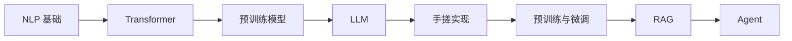

# 《Happy-LLM从零开始的大语言模型原理与实践教程》读书笔记

## 关联笔记

- [[Happy-LLM从零开始的大语言模型原理与实践教程-行动清单与金句摘录]]
- [[大语言模型]]
- [[Transformer]]
- [[技术学习阅读索引]]

## 一句话总结

这本书最大的价值，是把“大模型很热”这件事拆回可学习的路径：从 NLP 基础、Transformer、预训练模型一路讲到搭建、微调、RAG 和 Agent，让我知道自己该怎样从会用走向会做。

## 一图速览

## 全书核心脉络

这本书的结构非常清楚：

1. 先回到 NLP 基础概念和发展脉络。
2. 再讲 Transformer 架构与注意力机制。
3. 接着梳理预训练语言模型与 LLM 的演进。
4. 然后动手实现小型模型和训练流程。
5. 最后扩展到微调、RAG、Agent 等应用层能力。

这种安排很舒服，因为它不是把读者直接扔进模型黑箱，而是给出一条从地基到应用的完整楼梯。

如果按学习体验来重新整理，我会把这本书看成五段连续递进：

### 第一段：先把 NLP 这条老路走明白

很多人现在接触 LLM，会直接从 ChatGPT、RAG、Agent 起步，结果学着学着就容易空心化，因为根基没有补。

这本书先从 NLP 的概念、发展历程、任务谱系讲起，其实是在提醒读者：大模型不是凭空长出来的，它是自然语言处理这条技术路线在某个阶段的集中爆发。

### 第二段：抓住 Transformer 这块真正的地基

LLM 的世界很大，名字很多，但如果把底层一直往下挖，Transformer 基本是绕不过去的核心地基。

这本书愿意花很多篇幅讲注意力机制、Encoder-Decoder、位置编码、Tokenizer，我觉得这特别对。因为如果这一步没吃透，后面很多模型差异只能停留在“听说过”。

### 第三段：看懂 PLM 到 LLM 的范式升级

从 BERT、GPT 这类预训练模型，到更大规模的 LLM，中间真正发生变化的，不只是模型参数，而是：

- 训练数据规模变了
- 训练目标变了
- 模型能力边界变了
- 开发者与模型交互的方式也变了

这本书把这个过程梳理出来，能让人少很多“只追新词”的焦虑。

### 第四段：从理解走向搭建

我很喜欢它不只停在理论，而是要带着读者去搭模型、训 Tokenizer、走预训练和微调流程。

这一步的价值在于，它迫使人从“懂道理”变成“理解细节”。

### 第五段：从模型走向系统

最后进入 RAG、Agent、评测这些内容时，视野其实已经从“模型本身”扩展到“围绕模型的系统能力”。

这恰恰是今天 LLM 落地最重要的一步：单看模型已经不够，真正能创造价值的是整套系统组合。

## 最触动我的几个观点

### 1. 学 LLM，不能只学“怎么调用”，还要学“它是怎么长出来的”

现在很多人接触大模型，第一步是 API、Prompt、工作流，这当然有用，但也容易停在“能用不会造”的层面。

这本书很可贵的一点，是把视角拉回到底层：

- NLP 是怎么一路演化过来的
- 为什么会走到 Transformer
- 预训练和微调为什么改变了研究范式
- 大模型为什么会出现涌现、上下文学习和指令理解能力

这让我更清楚，理解技术路径，本身就是减少盲目追热点的一种方式。

我觉得这是整本书最难得的气质。

现在互联网上和 LLM 相关的内容非常多，但大量内容都在解决“怎么更快上手”，很少认真处理“为什么会这样发展、现在这条路线背后的逻辑是什么”。

而一旦不去理解技术是怎么长出来的，就很容易出现这些状态：

- 今天追 Prompt，明天追 Agent，后天追工作流
- 知道很多名词，但它们彼此之间没有结构关系
- 遇到一个新模型，不知道它到底是在旧链路的哪一层做创新

这本书恰恰在帮人补这个结构感。

### 1.1 为什么理解演化路径，会比记模型名字更重要

我读的时候越来越强烈地感到，真正有用的不是“我知道 GPT、BERT、LLaMA、Qwen、DeepSeek”，而是：

- 我知道它们分别属于哪类架构
- 我知道它们在前一代基础上改了什么
- 我知道它们解决了哪类问题
- 我知道它们各自更适合什么场景

只有这样，技术学习才不是资讯堆积，而是真正的理解增长。

### 2. Transformer 不是一个知识点，而是一整代模型的底座

书里把注意力机制、Encoder/Decoder、位置编码、Tokenizer 等东西连起来讲，我觉得非常必要。

因为很多人会记住“Transformer 很重要”，却并没有形成结构感。这本书提醒我：如果连底层骨架都没看懂，就很难真正理解后面各种模型分支为什么会那样设计。

这本书在这部分的价值，不只是解释“注意力是什么”，而是帮我把几个常见却总是零散出现的概念重新串起来：

- 为什么 RNN/LSTM 不够用了
- 为什么注意力机制这么关键
- 为什么并行计算能力会改变训练效率
- 为什么位置编码不是可有可无的小配件
- 为什么 Encoder-only、Decoder-only、Encoder-Decoder 会走向不同应用场景

一旦这些东西被连起来，Transformer 就不再只是一个著名名词，而会变成你脑子里一张能不断展开的结构图。

### 2.1 从“会背组件”到“理解设计动机”

我以前也会把 Transformer 理解成若干组件堆起来的模型：

- Attention
- Multi-Head
- FFN
- Residual
- LayerNorm

但真正开始有感觉，是当我不再只是背组件，而是不断问“为什么这里要这样设计”。

比如：

- 为什么要多头，而不是单头
- 为什么要位置编码
- 为什么要残差连接
- 为什么掩码注意力会影响生成方式

这本书带着读者从这些问题走过去，这点特别关键。

### 3. 大模型学习最好的方式，是理论和手搓同时推进

这本书不只是讲概念，还明确安排了“手把手搭建 Transformer”“实现 LLaMA2”“走完整个预训练与微调流程”。

这点特别对我胃口。因为大模型如果只看论文和概念，很容易觉得自己懂了；但一到真正搭模型、训 Tokenizer、跑训练流程、做微调与评测时，问题才会暴露出来。

真正的理解，往往发生在“代码为什么跑不通”和“这个模块为什么这样设计”的摩擦里。

我对这一点非常认同，甚至觉得这是技术学习里最容易被偷懒的一环。

很多时候我们读完一篇文章、看完一套教程，会产生一种“我已经懂了”的错觉。但只要真的去写一遍：

- 维度对不对
- mask 怎么传
- tokenizer 怎样切分
- loss 在哪里算
- 数据怎样喂进去
- 训练为什么爆显存

这些具体问题一出来，理解立刻就变得诚实了。

### 3.1 为什么“手搓一个小模型”特别有价值

书里安排自己实现小型模型和训练流程，我觉得非常有教学智慧。

因为直接站在工业框架上，很容易变成：

- API 会调
- 配置会改
- 现成脚本会跑

但这些还不等于真正理解。

自己手搓哪怕一个很小的 Transformer 或 Tiny LLM，都能逼你面对很多底层问题：

- 输入输出张量是怎么流的
- 参数量为什么会这样增长
- 训练目标到底在优化什么
- 一次前向和一次反向到底发生了什么

这种理解会非常扎实。

### 4. LLM 不是终点，真正关键的是整条能力链

书后面把 RAG、Agent、评测也纳入进来，这让我很认同。

因为大模型真正有生产力，不只靠基座模型本身，还要看：

- 训练和微调是否合理
- 检索和知识接入是否到位
- 评测是否真实
- 应用形态是否适合场景

也就是说，今天做 LLM，很少只是“选一个模型”这么简单，而是要理解整条系统链路。

我觉得这本书把 RAG、Agent、评测放进来，实际上是在提醒读者一件非常现实的事：

今天的大模型工作，已经不是单纯“研究模型”的工作，而是“构建基于模型的系统能力”的工作。

如果只盯着参数量和榜单，容易忽略真正决定结果的很多东西：

- 知识怎么接入
- 工具怎么调用
- 幻觉怎么控制
- 场景怎么评估
- 成本和延迟怎么权衡

这意味着，一个做 LLM 的人，最后往往要同时面对模型、数据、工程、产品和场景问题。

### 4.1 从“模型崇拜”走向“系统视角”

我觉得这是读这本书后一个很重要的认知转变。

大模型很容易让人产生一种技术浪漫主义，好像只要模型够强，一切问题都会迎刃而解。但现实往往不是这样。

很多系统落地失败，不是因为模型不够好，而是因为：

- 数据源不可靠
- 评测方式太虚
- 需求定义不清
- 工作流设计不合理
- 人机协作边界没想明白

所以书里后半段的价值，不只是教一些新概念，而是在训练一种更完整的系统观。

## 我的读后体会

这本书给我的最大帮助，是把“大模型学习”从一种焦虑感，变成一条可拆解的路线图。

很多时候大家会被 LLM 领域的发展速度吓到，感觉新名词永远追不完。但读完之后我反而更平静了，因为我意识到，真正稳的学习方式并不是追每一个热点，而是先吃透不太会过时的东西：

- NLP 基础
- Transformer
- 预训练与微调范式
- 训练流程
- 应用层组合思路

只要这些地基稳，后面模型再怎么换代，理解都会跟得上。

更细一点说，它还帮我把“LLM 学习焦虑”拆成了几个可处理的问题。

以前容易焦虑，是因为会觉得：

- 新模型太多
- 新框架太多
- 新术语太多
- 每天都像落后了一截

但这本书让我更愿意把问题换一种方式来看：

- 哪些是会快速变化的表层
- 哪些是值得长期持有的底层
- 我现在最该补的是哪一层

一旦这样分层，学习就从“被热点推着跑”变成“自己知道在修哪一层楼”。

### 这本书对我的现实价值

我觉得它对我最现实的价值有三层：

1. 让我能更平静地看待新模型迭代，不至于一看到新名字就慌。
2. 让我知道真正值得长期投入的地方，是架构、训练范式和系统能力。
3. 让我意识到，如果以后真的想做出有价值的 LLM 项目，就不能只停在 API 调用层。

这也是为什么我会把它看成一本“学习路线矫正书”，而不只是一本技术教程。

## 对我最有用的行动提醒

### 学习路径上

- 先搭完整知识主线，再追前沿论文和新模型。
- 先理解底层原理，再做工具层封装和调用。
- 让“会跑 demo”升级为“知道为什么这么跑”。

### 实践方式上

- 多自己实现小型模块，减少只看不做。
- 在实践中同时关注数据、Tokenizer、架构、训练和评测。
- 对 RAG、Agent 这类应用层能力，也要回到基础原理看。

### 心态上

- 不被模型名字牵着走，先抓住稳定的底层骨架。
- 接受 LLM 学习是长期工程，不可能一口吃透。
- 把每次手搓和复现，当成建立结构感的过程。

## 我想把这本书落实成的习惯

1. 每学一个大模型概念，都追问它在整条链路里的位置。
2. 动手复现一个小型模块，而不是只停留在概念层理解。
3. 给自己的 LLM 学习建立“原理 - 实现 - 训练 - 应用”的四层框架。

## 哪些人尤其适合重读这本书

- 想从“LLM 使用者”走向“LLM 开发者”的人。
- 会调 API，但对底层原理总感觉发虚的人。
- 学过一点 NLP 或深度学习，但没把它们和大模型真正接起来的人。
- 想做 RAG、Agent、微调，却总觉得自己缺底座的人。

## 我会怎么再读这本书

如果以后重读，我会按这四条线来带着问题看：

1. 原理线：NLP 到 Transformer 到 LLM，范式究竟怎么变了。
2. 架构线：不同模型结构是如何服务不同目标的。
3. 训练线：预训练、微调、LoRA、QLoRA 这些方法到底解决了什么成本问题。
4. 应用线：RAG、Agent、评测怎样和模型能力闭环。

这样再读，收获会比“顺着章节读一遍”更大。

## 可继续延展的主题

- [[大语言模型]]
- [[Transformer]]
- [[技术学习阅读索引]]
- [[长期主义]]

## 最后一句话

这本书让我更确定，真正可靠的大模型学习，不是快速收集名词，而是把底层原理、训练过程和应用链路一点点接通。
