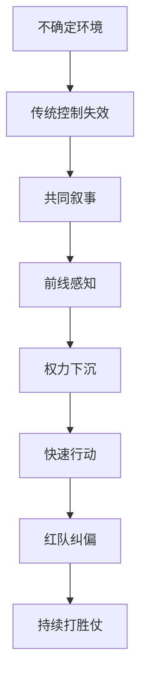

# 《打胜仗的思想》读书笔记

## 关联笔记

- [[打胜仗的思想-行动清单与金句摘录]]
- [[包容式领导]]
- [[红队思维]]
- [[长期主义]]

## 一句话总结

这本书最想改变的，不是某个管理技巧，而是一种领导者本能：别再把“控制”误当成“领导”，真正能打胜仗的组织，靠的是包容、信任、前线感知、快速行动和持续纠偏。

## 一图速览

## 全书核心脉络

从前言和前几章线索看，这本书大致围绕几件事展开：

1. 我们正处在一个高度不确定、叙事竞争激烈的时代。
2. 传统自上而下的领导方式越来越难应对复杂变化。
3. 真正有效的组织文化，要能创造包容性的共同叙事。
4. 决策权需要向更接近前线的人流动。
5. 组织必须建立红队式的自我挑战能力，避免集体失明。

它表面在谈军队和企业，底层其实在谈：在一个变化比指令更快的世界里，领导力应该如何重新定义。

如果把它再拆细一点，我会把这本书理解成四层递进：

### 第一层：先承认世界真的变了

作者并不是简单地说“现在比过去更复杂”，而是在强调一种结构性变化：

- 信息传播速度前所未有地快
- 真假信息混杂，叙事竞争越来越激烈
- 组织不再处在相对稳定、可预测的环境中
- 领导者不可能再像过去那样依赖中心化控制完成有效治理

这一层很重要，因为很多组织的问题，不是能力不够，而是时代已经变了，组织却还在使用旧时代的默认操作系统。

### 第二层：传统领导逻辑正在失效

过去那种“高层负责判断，基层负责执行”的模式，在相对稳定、变化较慢、因果链比较清晰的环境中是成立的。

但在今天，这套逻辑越来越容易出问题，因为：

- 决策中心离真实现场太远
- 信息在传递过程中不断损耗、过滤、延迟
- 高层的判断速度，跟不上一线变化速度
- 层级过多会让组织陷入等待和迟钝

这本书不是反对领导，而是在提醒：领导如果还等于控制，组织就会越来越笨重。

### 第三层：组织要从“命令系统”转向“感知系统”

我觉得这是这本书最打动我的部分。真正强的组织，不只是命令传得快，而是感知要足够灵敏。

所谓感知系统，包含几件事：

- 一线能够及时看见变化
- 一线的发现能被组织吸收
- 组织愿意修正原有判断
- 决策权能够随着情境流动

这其实意味着，领导力的重点从“我比你更懂”转向“我能不能让组织持续看清”。

### 第四层：打胜仗靠的是一套持续生成正确行动的机制

书名很像结果导向，但我读下来反而觉得它最关注“机制”。

胜仗背后真正值得研究的不是一次漂亮结果，而是：

- 为什么组织没有陷入自我陶醉
- 为什么前线敢说真话
- 为什么不同意见不会被压平
- 为什么组织能快速行动、快速纠偏

换句话说，打胜仗不是一次意外的成功，而是组织长期训练出来的能力结构。

## 最触动我的几个观点

### 1. 组织文化的核心，不只是价值观口号，而是共同叙事

书里提到一个很有力量的判断：文化本质上是一种叙事，而且应该是一种包容性的叙事。

这句话让我很受触动。因为很多组织一谈文化，就容易变成墙上的词、会上喊的口号。但真正有用的文化，应该回答的是：

- 我们为什么在一起
- 我们共同在完成什么
- 组织成员是否真的相信这件事与自己有关

如果没有共同叙事，再漂亮的制度也很容易沦为空转。

我对“共同叙事”这件事的体会还不止一层。

很多组织也会讲愿景、使命、价值观，但问题在于，那些话到底是：

- 领导层用来要求别人的
- 市场部用来对外包装的
- 还是组织成员真的愿意把自己放进去的

真正的共同叙事，应该让成员在心里回答出三个问题：

1. 我为什么在这里。
2. 这件事为什么值得我投入。
3. 我的工作与组织目标之间到底是什么关系。

如果这些问题答不出来，组织文化再热闹，也只是表演。

### 1.1 包容性的叙事，和单向灌输的叙事有什么不同

我读这本书时一直在想，很多组织都“有叙事”，但不一定“有包容性的叙事”。

单向灌输的叙事往往有几个特征：

- 只有少数人拥有解释权
- 组织成员只能接收，不能参与塑造
- 一旦现实和叙事冲突，组织会优先保护叙事

而包容性的叙事恰恰相反：

- 允许不同位置的人补充现实
- 允许一线经验修正中心判断
- 让成员感觉自己不是被动被管理，而是在共同完成一件事

这让我意识到，文化真正的强弱，不看口号多响亮，而看它能不能容纳真实。

### 2. 最好的主意，很多时候不在中心，而在前线

这本书反复强调，真正关键的信息往往来自最前沿，而不是组织中心。

这点很重要。因为组织一旦做大，最容易出现的错觉就是：位置越高，看得越清楚。现实常常正好相反。越靠近一线的人，越早感知变化、客户、风险和机会。

所以领导者真正该做的，不只是发号施令，而是建立让前线信息能够上来、前线判断能够发挥作用的机制。

这点对企业尤其有现实感。

很多组织表面上也说“要听一线声音”，但实际流程是：

- 一线先向上汇报
- 中层再做加工
- 高层最后得到一份“适合看的版本”

结果是，真正最关键的信息，往往在层层传递中被磨平了。最后决策当然很整齐，但也很容易很迟钝。

这本书真正提醒我的，是要把“接近问题的人是否拥有足够判断权”视为一个组织健康度指标。

### 2.1 前线为什么不只是执行端，更是认知端

我以前更容易把前线理解成“动作发生的地方”，读完之后更愿意把前线看成“认知发生的地方”。

因为最早发现异常的人，通常不是指挥中心，而是直接接触客户、战场、项目、系统的人。

一旦组织仍然把前线只当执行端，就会出现一个危险结果：

- 最了解情况的人没有决策权
- 最有决策权的人不掌握第一手情况

这正是复杂环境里很多组织会不断变慢、变钝、变僵的原因。

### 3. 放弃部分控制，不是削弱领导，而是升级领导

书里的一个核心转向是：从“我们决策，他们执行”，转向“我们定方向，他们决策，他们执行”。

这听起来像放权，但本质上是对领导力的升级要求。因为真正困难的地方，不是把事抓在手里，而是在不确定中给出方向、边界、节奏和信任。

这让我意识到，很多管理者并不是不会努力，而是不愿意放弃“我必须亲自掌控”的安全感。

我对这点的共鸣很深，因为现实里“控制欲”常常被包装成责任心。

很多管理者心里会觉得：

- 不亲自看，我不放心
- 不亲自拍板，出了问题谁负责
- 下面的人经验不够，还是我来定更稳

这些想法并不一定出于坏意，但它们很容易把组织训练成一个永远抬头等指令的系统。

### 3.1 真正难的不是放权，而是建立可放权的环境

我觉得这本书没有把放权写成一个轻飘飘的姿态问题，这一点很好。

因为真正困难的，不是嘴上说一句“你们自己决定”，而是同时建立这些东西：

- 清晰的方向
- 可理解的边界
- 足够的信任
- 对错误的容错方式
- 对反馈的吸收机制

没有这些，所谓放权很容易变成甩锅。

所以这本书让我更清楚，领导者的成熟，不是退场，而是把自己从“所有事情的唯一判断者”升级为“组织判断能力的设计者”。

### 4. 红队思维不是找茬，而是组织免疫系统

书里把红队策略放得很重，这一点我很认同。

一个组织越成功，越容易掉进自己的叙事里；越多人认同，越难有人愿意泼冷水。而真正大的失败，往往不是因为没有执行，而是因为从一开始就没看见关键盲点。

所以红队思维的价值，在于让组织内部保留一种制度化的“不顺耳声音”，避免把一致误当成正确。

我特别喜欢把红队思维理解成“组织免疫系统”。

一个人如果没有免疫系统，看起来可能短期很平静，但真正的风险是在没有防御能力时突然垮掉。

组织也一样。没有红队能力的组织，短期会显得：

- 更一致
- 更顺畅
- 更少冲突
- 会议更容易达成共识

但这些“顺”，很多时候只是把问题压了下去，而不是把问题看清楚。

### 4.1 为什么越成功的组织，越需要红队

这本书让我想到一个很现实的悖论：组织越成功，越容易不再欢迎异议。

因为一旦成功形成惯性，组织会自然发展出几种危险倾向：

- 把过去成功经验当成普遍规律
- 把提出不同意见的人视为不合群
- 把一致理解为成熟
- 把怀疑视为拖后腿

这时候，红队思维就不再是锦上添花，而是防止组织从高处摔下来的刹车系统。

### 5. 打胜仗不是一次胜利，而是一种持续生成胜利的机制

我读下来最深的感觉是，这本书并不是在教“如何赢一仗”，而是在追问：什么样的文化和领导方式，能让组织持续具备打胜仗的能力。

也就是说，重点不只是结果，而是：

- 组织是否有归属感
- 是否有快速行动偏好
- 是否有真实信任
- 是否能持续听到异议
- 是否能让一线不断做出更好的决策

我很喜欢把这句话再往前推一步：所谓打胜仗，其实是“高质量行动不断出现”的结果。

而高质量行动不断出现，又离不开几种底层条件：

- 组织内部有真实信息流动
- 成员之间存在足够信任
- 错误能被及时暴露，而不是被层层遮掩
- 组织不因一次成功而停止反思

所以这本书最深的提醒，不是“如何更狼性”，而是“如何让组织持续保持清醒、灵活和战斗力”。

## 我的读后体会

这本书让我重新看待“领导力”这个词。过去一想到领导力，很容易想到个人魅力、决断力、鼓舞力，但这本书更让我看到：真正成熟的领导力，不是让所有人更依赖你，而是让组织在没有你亲自盯着时，依然能保持清醒、协同和战斗力。

它也让我联想到很多企业常见问题：开会很多、信息很慢、人人都想向上负责、没人真向客户和前线负责、组织里充满正确废话却没有真实分歧。归根到底，这些不是执行问题，而是文化和领导力结构的问题。

再往深一点说，这本书让我重新理解了“强组织”和“强领导”的区别。

很多时候我们会把两者混在一起：

- 有一个很强的领导者，就以为组织也强
- 高层很有魄力，就以为系统也有韧性
- 命令传得很快，就以为组织反应很快

但其实这些都不一定成立。

一个真正强的组织，至少应该具备这些特征：

- 不靠单点英雄也能运转
- 不怕坏消息上来
- 能在模糊中快速试错
- 能从前线不断获得新认知
- 能在成功之后继续自我怀疑

这也是我觉得这本书比一般领导力读物更有价值的地方。它不是在塑造“更厉害的管理者形象”，而是在试图塑造一种更现代的组织观。

### 这本书对我现实工作的映照

如果把它往现实工作里套，我觉得它会不断逼我问这些问题：

- 我的团队里，真实信息是向上流动，还是被包装后流动？
- 团队中的异议是被欢迎，还是被礼貌忽略？
- 前线的人有多大决策空间？
- 我是在培养组织能力，还是在强化个人依赖？
- 我是不是把“可控”误当成“有效”？

这些问题读的时候有点刺痛，但也正因为如此，它才不是一本轻飘飘的鸡汤书。

## 对我最有用的行动提醒

### 在组织里

- 多关注组织成员是否真的理解并认同共同目标。
- 给前线更多判断空间，而不只是更多任务。
- 建立允许异议和纠偏的机制。

### 在领导上

- 定方向、定边界、定节奏，比事事控制更重要。
- 少问“他们为什么没照我说的做”，多问“是不是信息和权力没有到该到的人手里”。
- 把信任视为效率的一部分，而不是情感附属品。

### 在决策上

- 对重要判断引入反方视角。
- 看到一致时先警惕，而不是先放心。
- 先行动、再学习、再修正，避免陷入决策瘫痪。

## 我想把这本书落实成的习惯

1. 做重要决策时，专门留出红队提问环节。
2. 带团队时，更多关注一线信息和共同叙事是否真实建立。
3. 遇到复杂问题时，减少“我要不要更强控制”，增加“我是不是该让更靠近问题的人参与判断”。

## 哪些人尤其适合重读这本书

- 正在带团队、但总觉得组织越来越慢的人。
- 业务变复杂后，开始感到“高层知道得越来越少”的管理者。
- 经常陷入会议很多、结论很多、行动很少的团队负责人。
- 想把组织从“靠英雄”带向“靠机制”的创业者和中层干部。

## 我会怎么再读这本书

如果以后重读，我会重点带着三条线去看：

1. 文化线：共同叙事、归属感、信任是怎么建立的。
2. 权力线：决策权怎样流动，怎样从中心流向前线。
3. 纠偏线：红队、异议、快速行动与快速修正怎样配合。

这样读，它就不只是一本领导力读物，而更像一本组织升级手册。

## 可继续延展的主题

- [[包容式领导]]
- [[红队思维]]
- [[长期主义]]
- [[系统性思维]]

## 最后一句话

《打胜仗的思想》让我更确定，真正强大的组织，不是把所有权力都握在中心，而是能把方向、信任和判断力一起分布出去。
