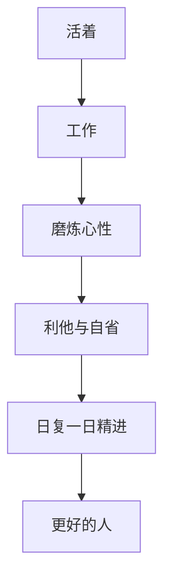

# 《活法》读书笔记

## 关联笔记

- [[活法-行动清单与金句摘录]]
- [[敬天爱人]]
- [[利他]]
- [[财富自由]]
- [[元认知]]

## 一句话总结

《活法》真正想塑造的，不是一套技巧，而是一种人生姿态：以正直、勤勉、利他、自省和长期精进的方式活着，让工作成为磨炼心性的道场。

## 一图速览

## 这本书在讲什么

这套书整体并不复杂，核心主线非常鲜明：

- 人为什么活着
- 工作为什么重要
- 心态为什么决定命运
- 为什么要利他、感恩、自律
- 怎样通过日复一日的认真生活来磨炼灵魂

它不是知识密度特别高的书，但它有一种很强的“价值观校正力”。

如果把这本书再往深处拆，我会把它看成三层递进：

### 第一层：先把“活着”这件事重新定义

这本书并不把人生理解成不断获取外在成绩，而是不断校正内在状态。

也就是说，它更关心：

- 我成为什么样的人
- 我的动机是否端正
- 我的心性是否更稳、更善、更诚

### 第二层：把工作从谋生手段提升为修炼场

这是稻盛和夫特别有力量的地方。他不是把工作神圣化，而是把工作重新解释为训练人格的地方。

### 第三层：把长期精进落回到今天

它最朴素、也最有力量的地方就在这里：别空谈远方，先把今天过扎实。

## 最触动我的观点

### 1. 人生的意义，在于磨炼灵魂

这大概是稻盛和夫最核心的判断。它和常见的成功学很不一样，因为它把“成就”放到后面，把“心性”放到前面。

这会让人重新思考很多问题：

- 成功到底是为了什么
- 工作为什么不能只看收入
- 苦难为什么也可能有价值

我读到这里最大的感受是，它迫使人从“结果中心”退一步，回到“我成了一个什么样的人”。

这句话看起来很朴素，但其实对现代人的价值观冲击很大。

因为我们太容易把“活得好”直接等同于：

- 赚得多
- 位置高
- 被看见
- 跑得快

而《活法》是在提醒：这些结果当然可以追求，但如果它们没有建立在更稳定的心性之上，就很容易让人外在成功、内在空心。

### 2. 努力工作，不只是谋生，也是修行

书里反复写“拼命工作”“认真过好今天”“通过工作磨炼人格”，这不是鸡血式勤奋，而是一种工作观。

在这种视角里，工作不只是交换工资，而是训练专注、责任感、韧性、诚实和持续改进的地方。这个角度很朴素，但很能打动人。

我觉得这部分很容易被误解成“鼓吹吃苦”，但我读下来并不是这种感觉。

更准确地说，它强调的是：一个人处理工作的方法，往往就暴露了他处理人生的方式。

比如：

- 敷衍还是认真
- 急躁还是沉着
- 遇到难题是抱怨还是承担
- 面对重复是厌烦还是精进

这些其实都不是纯工作问题，而是人格问题。

### 3. 心态决定命运

《活法》很强调思维方式的重要性。能力、热情、努力当然都重要，但如果底层心念错了，最后走出来的人生也会偏。

这和你现有库里的[[元认知]]、[[注意力]]其实可以互相照应：一个人的命运，常常是被他长期喂养的念头、选择和行为习惯塑出来的。

我很认同这一点，因为它让“命运”这件事不再神秘。

很多所谓命运，背后其实是：

- 长期注意力投向
- 长期情绪反应方式
- 长期面对困难的姿态
- 长期做选择时的底层原则

也就是说，一个人的人生，往往是被他一遍又一遍重复的心念塑出来的。

### 4. 利他不是软弱，而是更高层次的经营逻辑

书里关于[[利他]]和[[敬天爱人]]的部分，既是伦理，也是一种经营哲学。

它提醒我，真正稳固的成功，不是建立在算计和掠夺之上，而是建立在：

- 动机是否善
- 是否对他人有益
- 是否经得起长期检验

我觉得稻盛和夫这里的厉害之处在于，他把“利他”同时放在伦理和经营两条线上。

这不是单纯劝善，而是在说：真正能持续的事业，往往建立在更长远的信任逻辑上。

短期算计也许有用，但很难形成真正稳固的关系、口碑和组织生命力。

### 5. 认真过好今天，比宏大口号更重要

稻盛和夫很强调“今天比昨天更进一步”。这点我很喜欢，因为它把宏大的理想，重新落回到每一天的行动里。

不是空谈志向，而是：

- 今天有没有认真工作
- 今天有没有自省
- 今天有没有比昨天更精进一步

这一点特别打动我，因为它让所有大道理都重新落地了。

如果没有“今天”的认真，再高远的价值观也容易变成自我感动。

## 我的读后体会

《活法》给我的感觉，不是“提供了新知识”，而是“重新整理了做人的坐标系”。

它不像《如何系统思考》那样提供工具，也不像《如何解决复杂问题》那样提供新的解释框架，它更像是在不断追问：

- 你的动机善吗？
- 你够诚实吗？
- 你真的在认真活吗？
- 你有没有把工作和生活过成修炼？

这种书适合反复读，因为很多话第一次看会觉得朴素，等经历多一点再看，会更能感到它的分量。

再往深一点说，这本书对我最大的作用，不是教我“如何成功”，而是不断把我从浮躁里往回拽。

它让我更愿意问：

- 我现在追求的东西，经不经得住长期检验
- 我的努力是在雕刻结果，还是也在雕刻自己
- 我是不是把聪明放在了诚实前面，把速度放在了扎实前面

## 我会怎么再读这本书

以后如果重读，我会重点带着三件事去看：

1. 我最近的工作状态，到底是在修炼，还是在消耗。
2. 我现在的目标和动机，是否已经偏了。
3. 我有没有把“认真过今天”让位给“幻想一次跨越”。

## 对我最有用的提醒

### 在工作上

- 不把工作只当作赚钱手段。
- 把认真、专注、负责当作基本修养。
- 用长期主义看职业和事业。

### 在做人上

- 多自省，少抱怨。
- 多利他，少算计。
- 多感恩，少觉得一切理所当然。

### 在生活上

- 别总想着一跃而成，先把今天过扎实。
- 真正重要的变化，往往来自日复一日的精进。

## 最后一句话

《活法》最深的力量，不在于教你如何赢，而在于提醒你，先成为一个值得赢的人。
