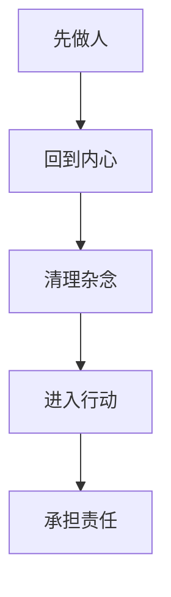

# 《做人：王阳明心学的真正传习》行动清单与金句摘录

来源主笔记：[[做人：王阳明心学的真正传习-读书笔记]]

## 一图速览

## 行动清单

### 每天

- 早上先问自己一句：今天我想成为什么样的人，而不只是今天要完成什么任务。
- 遇到情绪波动时，先停 30 秒，分辨这是本心，还是面子、恐惧、比较心在反应。
- 至少做一件“我知道应该做，所以立刻去做”的小事，训练知行一致。

### 每周

- 写一次短复盘：这一周我在哪些地方更像在“求人认可”，哪些地方更像在“做人”。
- 检查一次自己最近最重的执念：是名、利、效率、控制感，还是害怕失去什么。
- 找一件正在逃避的小责任，把它正面做完。

### 每月

- 盘点一次：我正在形成的人格，和我想成为的人，是否越来越接近。
- 检查自己做事是否有“意义、目标、行动、切入点”四要素。
- 主动修正一个长期拖着不处理的关系、承诺或习惯。

## 可直接抄用的复盘问题

- 我最近最常被什么牵着走？
- 我现在做的事情，是在求外在位置，还是在扎实做人？
- 我有哪些道理其实早就知道，只是没有行动？
- 我最想逃开的责任是什么？为什么？
- 如果按“我应成为怎样的人”来判断，我现在最该先做什么？

## 金句摘录式总结

- 做人这一件事，就像水的源泉，就像树的根。
- 我们最不应该错过的，是我们自己的心。
- 意义、目标、行动、切入点，这四个元素把生命坐实。
- 知是行的开始，行是知的结果。
- 拂袖而去很容易，难的是留下来。

## 高风险提醒

- 最容易出现的问题，不是不努力，而是努力全投给了外在位置。
- 最危险的不是痛苦，而是心被痛苦完全占满。
- 最常见的自欺，不是不会说大道理，而是把“懂了”错当成“做到了”。
- 最容易逃避的，不是任务本身，而是自己该承担的责任。

## 我最想长期记住的三句话

1. 先把“我该成为什么样的人”想明白，再谈其他。
2. 真正的修行，不在嘴上，在心上，也在事上。
3. 留下来承担，往往比漂亮地退出更难，也更见分量。

## 下次重读时重点看

- [[长期主义]]
- [[系统性思维]]
- [[哲学思考]]
- [[利他]]
- [[敬天爱人]]
