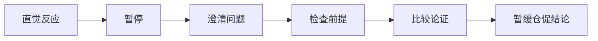

# 《哲学入门课14天突破哲学大门》行动清单与金句摘录

来源主笔记：[[哲学入门课14天突破哲学大门-读书笔记]]

## 一图速览

## 行动清单

### 遇到一个观点时

- 先问：它的前提是什么？
- 再问：这个结论真的是从前提推出的吗？
- 再问：有没有被忽略的另一种解释？

### 遇到一个道德判断时

- 我在看结果，还是在看动机？
- 我有没有把别人只当成手段？
- 如果角色互换，我还会这样判断吗？

### 遇到自我怀疑或人生问题时

- 我是在焦虑答案，还是还没把问题问清？
- 我到底在追求真理、安慰，还是确定感？
- 哪些信念只是我习惯了，而不是我想清楚了？

## 可直接抄用的思辨模板

- 我现在讨论的，真的是同一个问题吗？
- 这个观点默认了哪些前提？
- 如果把这个原则推到底，会出现什么后果？
- 反方最强的论证是什么？
- 我到底是在表达直觉，还是在给出论证？

## 最容易掉进去的坑

- 看到熟悉结论就自动点头。
- 以为“多数人都这么觉得”就是理由。
- 觉得一个观点有用，就默认它也正确。

## 金句式总结

- 哲学不是急着回答，而是先学会把问题问对。
- 直觉很重要，但直觉也需要被审问。
- 怀疑不是破坏思考，而是保护思考。
- 很多混乱，不是世界太乱，而是概念没说清。
- 哲学最后总会回到一个问题：我该怎样活。

## 我最想长期记住的三句话

1. 先问清问题，再急着站队。
2. 直觉可以有，但论证不能省。
3. 暂时保留判断，也是一种成熟。
