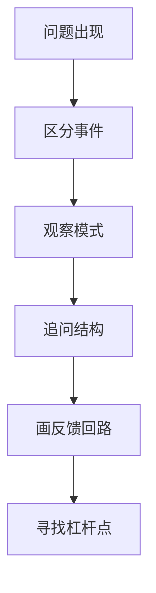

# 《如何系统思考》行动清单与金句摘录

来源主笔记：[[如何系统思考-读书笔记]]

## 一图速览

## 行动清单

### 遇到问题时

- 先区分：这是事件、模式，还是结构。
- 先看动态变化，而不是只看当前截面。
- 先问相互作用，而不是急着找单一原因。

### 分析问题时

- 用[[冰山模型]]向下多问一层。
- 用[[因果回路图]]画出关键变量之间的关系。
- 识别这是增强回路还是调节回路。
- 尝试寻找真正的[[杠杆点]]。

### 复盘时

- 这次我是在解决症状，还是解决结构？
- 我是否只优化了局部，却损害了整体？
- 有没有时间延迟让我误判了因果？

## 可直接抄用的周复盘模板

- 本周反复出现的一个问题是什么？
- 它是单次事件，还是其实已经有模式？
- 这个模式背后的结构是什么？
- 哪两个变量最值得先画成回路？
- 我现在最可能误修的是症状还是根因？
- 如果只改一个位置，最可能的杠杆点在哪里？

## 最容易犯的三个误区

- 一看到问题就立刻补救，没有先分清层次。
- 只找责任人，不看系统怎样把人推成这样。
- 以为更用力就会更有效，而没有先找杠杆点。

## 金句式总结

- 就事论事，往往只能就错事再用力一次。
- 事件只是水面，结构才是深处。
- 复杂问题很少有单线因果，更多是反馈回路。
- 不是更用力就更有效，而是找对杠杆才有效。
- 系统思考的价值，不在复杂，而在看清复杂背后的简单结构。

## 我最想长期记住的三句话

1. 别急着处理事件，先看它是不是模式。
2. 别急着怪个人，先看系统怎么运作。
3. 别急着加力，先找杠杆。
