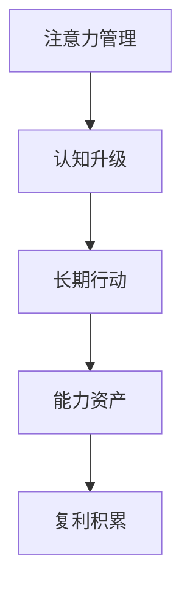

# 《认知红利》行动清单与金句摘录

来源主笔记：[[认知红利-读书笔记]]

## 一图速览

## 行动清单

### 每天

- 记录今天的注意力主要花在了哪三件事上。
- 至少留出一段 30-60 分钟的不被打断的深度专注时间。
- 少一次无意识刷手机，多一次主动阅读或输出。

### 每周

- 做一次一周复盘：我做的哪些事情在积累复利。
- 写一篇短笔记，把新学到的概念连接到旧知识上。
- 检查本周是否把精力投给了真正重要的人和事。

### 每月

- 盘点自己的能力组合有没有增强。
- 判断自己当前做的事，是在卖时间，还是在积累资产。
- 重新检查一次长期方向，避免忙碌替代成长。

## 可直接抄用的周复盘模板

- 我这一周最多的注意力给了什么？
- 这些注意力真的在为我积累长期价值吗？
- 我做的哪些事在形成复利，哪些事只是即时消耗？
- 我有没有把“信息很多”误当成“认知升级”？
- 下周最值得保护的一段高质量注意力，应该给哪件事？

## 可直接抄用的复盘问题

- 我最近把最多的注意力给了什么？
- 这些注意力有没有真正产生价值？
- 我现在做的哪件事，最可能在未来产生复利？
- 我有没有被低价值信息持续收割？
- 我这段时间是在升级认知，还是只是在堆积信息？

## 金句摘录式总结

- 注意力不是普通资源，而是我最值得珍惜的原始财富。
- 财富自由的关键，不是钱的数字，而是收入是否摆脱了对个人时间的强绑定。
- 复利最难的阶段，往往不是后期加速，而是前期看不见变化时仍然继续。
- 真正拉开差距的，不只是努力程度，更是认知系统的版本。
- 解决人生问题，很多时候不是继续硬拼，而是先升级看问题的维度。

## 高风险提醒

- 最危险的不是没时间，而是注意力被悄悄收割。
- 最容易自我安慰的，不是没努力，而是努力方向没升级。
- 最容易半途而废的，不是没理解复利，而是熬不过前期沉默期。

## 我最想长期记住的三句话

1. 我把注意力投给什么，什么就会变强。
2. 重复做正确的事，然后给时间一点时间。
3. 与其抱怨环境，不如先升级自己的认知系统。

## 下次重读时重点看

- [[注意力]]
- [[复利]]
- [[元认知]]
- [[结构化思维]]
- [[系统性思维]]
