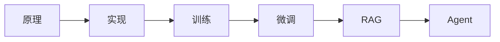

# 《Happy-LLM从零开始的大语言模型原理与实践教程》行动清单与金句摘录

来源主笔记：[[Happy-LLM从零开始的大语言模型原理与实践教程-读书笔记]]

## 一图速览

## 行动清单

### 每天

- 学一个 LLM 概念时，顺手标出它属于原理、训练还是应用层。
- 遇到一个新名词，先追它与 Transformer、预训练、微调的关系。
- 记录一个今天终于连起来的知识点。

### 每周

- 手动复现一个小模块，比如注意力、Tokenizer 或简单训练流程。
- 回看一次 Transformer 或预训练模型的基础章节。
- 选一个应用方向，思考它真正依赖了哪些底层能力。

### 每月

- 盘点自己是否还停留在“会调用”，还是已经向“会理解、会搭建”推进。
- 整理一个专题小结，比如预训练、微调、RAG 或 Agent。
- 用自己的话重讲一遍 LLM 的完整学习路径。

## 可直接抄用的学习复盘

- 我最近学到的新东西，属于原理、实现、训练还是应用层？
- 这个新模型或新框架，本质上是在旧链路上改了哪一层？
- 我现在最薄弱的是底层架构理解，还是系统化落地能力？
- 如果让我讲一遍完整链路，我在哪一步最容易卡住？

## 高风险提醒

- 只追模型名字，很容易失去结构感。
- 只会调 API，很难真正理解能力边界。
- 只学应用套路，不补底层，会让后续成长越来越虚。

## 可直接抄用的复盘问题

- 这个新模型是在旧链路上改了哪里？
- 我现在最薄弱的是架构、训练，还是应用系统思维？
- 我是真的理解了原理，还是只是记住了名词？
- 如果让我从头讲这条技术路线，我能讲清楚吗？

## 金句摘录式总结

- 大模型学习不能只停留在“怎么调用”，还要回到底层原理。
- Transformer 不是一个热点词，而是一整代模型的底座。
- 真正的理解，往往发生在自己动手搭和训的时候。
- LLM 的价值不只在模型本身，还在整条训练到应用的能力链。

## 我最想长期记住的三句话

1. 先抓地基，再追热点。
2. 会用只是起点，会做才更扎实。
3. 原理、实现、训练、应用，要一起长。

## 我最想长期记住的三句话

1. 先抓地基，再追热点。
2. 会用只是起点，会做才更扎实。
3. 原理、实现、训练、应用，要一起长。

## 下次重读时重点看

- [[大语言模型]]
- [[Transformer]]
- [[技术学习阅读索引]]
