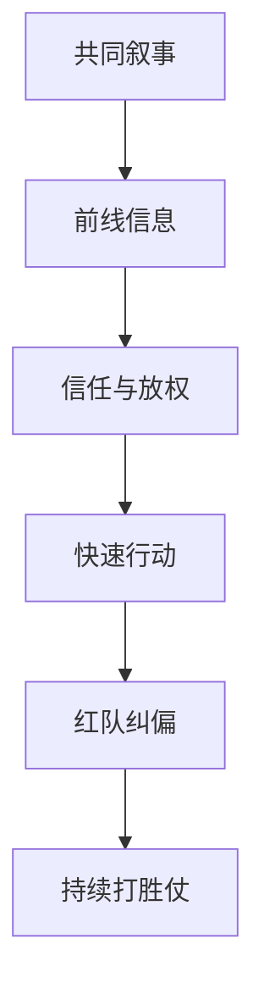

# 《打胜仗的思想》行动清单与金句摘录

来源主笔记：[[打胜仗的思想-读书笔记]]

## 一图速览

## 行动清单

### 每天

- 多听一次前线或执行层真实声音。
- 问自己一次：我现在是在领导，还是只是在控制？
- 对一个习以为常的判断，尝试提出反方问题。

### 每周

- 复盘一次团队里最重要的信息是从哪里来的。
- 检查一次团队是否真的理解共同目标，而不只是会复述口号。
- 设计一次小范围的“红队讨论”，挑战一个默认前提。

### 每月

- 盘点哪些决策权其实可以下放给更靠近问题的人。
- 检查团队里是否存在决策瘫痪、信息过滤和表面一致。
- 回看组织文化，到底在鼓励真实判断，还是鼓励安全表态。

## 可直接抄用的团队复盘

- 团队真正相信的目标，和墙上写的目标是同一件事吗？
- 最关键的信息是怎么流动上来的？
- 我们有没有把一致误判成成熟？
- 哪个决定其实更应该由前线做，而不是由中心拍板？
- 团队里有没有一个安全空间，让不同意见能真的出现？

## 高风险提醒

- 组织越成功，越容易不欢迎异议。
- 高层越忙，越可能离真实情况越来越远。
- 表面秩序很好时，往往最值得检查是否只是被控制住了。

## 可直接抄用的复盘问题

- 我们现在的叙事，团队成员真的信吗？
- 最关键的信息，是不是被层层过滤了？
- 我们有没有把“一致”误当成“正确”？
- 我最近在哪些地方控制过多、信任过少？

## 金句摘录式总结

- 真正的文化，不只是口号，而是组织共同相信的叙事。
- 最有价值的信息，往往来自最前线，而不是最中心。
- 放弃部分控制，不是削弱领导，而是升级领导。
- 红队思维不是内耗，而是组织防止盲区的免疫机制。
- 打胜仗靠的不只是强执行，更是持续生成胜利的组织方式。

## 我最想长期记住的三句话

1. 领导者定方向，不必包办所有判断。
2. 一线不只是执行端，也应该是认知端。
3. 没有异议的组织，往往最危险。

## 我最想长期记住的三句话

1. 领导者定方向，不必包办所有判断。
2. 一线不只是执行端，也应该是认知端。
3. 没有异议的组织，往往最危险。

## 下次重读时重点看

- [[包容式领导]]
- [[红队思维]]
- [[长期主义]]
