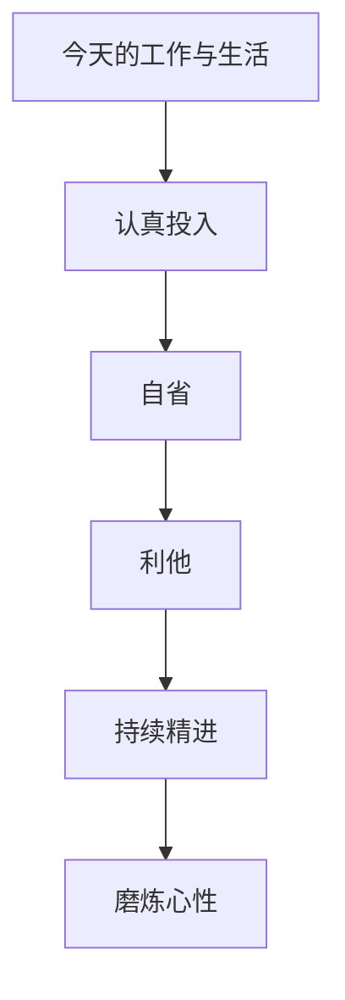

# 《活法》行动清单与金句摘录

来源主笔记：[[活法-读书笔记]]

## 一图速览

## 行动清单

### 每天

- 认真完成今天最重要的工作。
- 晚上做一次简短自省：今天的动机、态度、情绪有什么偏差。
- 至少做一件明确利他的事。

### 每周

- 复盘：我是在追求结果，还是也在提升心性。
- 检查自己有没有把忙碌误当作精进。
- 反思最近的抱怨、焦虑、计较是否过多。

### 长期

- 把工作当作修炼场，而不是只当收益来源。
- 练习诚实、节制、感恩和自律。
- 做决策时多问一句：动机善否，私心有无？

## 可直接抄用的晚间复盘

- 我今天有没有认真对待手上的工作？
- 我今天有没有因为情绪、懒散或私心偏离原则？
- 我今天做的哪件事，是明确对别人有益的？
- 我今天有没有比昨天更诚实、更专注、更踏实一点？

## 这本书最适合什么时候回看

- 工作浮躁、内心发飘的时候。
- 很想快速出结果、开始嫌慢的时候。
- 做成一点事却开始自满的时候。
- 遇到挫折，怀疑认真还有没有意义的时候。

## 金句式总结

- 人生的意义，不只是获得，而是磨炼。
- 工作不只是谋生，也是修行。
- 心态决定命运，动机决定走向。
- 利他不是吃亏，而是更长远的正确。
- 真正的成长，往往藏在认真过好今天里。

## 我最想长期记住的三句话

1. 先把今天活扎实。
2. 工作也是修行。
3. 先成为值得赢的人。
