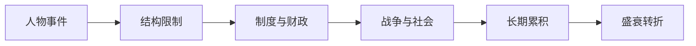

# 《乾坤万象 明朝那些人事儿》行动清单与金句摘录

来源主笔记：[[乾坤万象明朝那些人事儿-读书笔记]]

## 一图速览

## 行动清单

### 每天

- 读一个历史人物时，同时问他受什么结构限制。
- 遇到一个历史转折时，先找前面的累积链条。
- 记录一个今天从历史里看到的现实映照。

### 每周

- 复盘一次“盛世背后的隐患”和“衰败背后的前因”。
- 用自己的话重讲一个阶段的主线，而不是只记碎片人物。
- 把一段历史和 [[系统性思维]] 或 [[长期主义]] 连接起来。

### 每月

- 盘点自己读历史时是否仍然过度人物化、道德化。
- 选一个王朝问题，试着从制度、财政、战争三个角度重看。
- 整理一篇历史短札，训练从故事走向结构。

## 可直接抄用的历史复盘模板

- 这段历史如果不只看人物，我看见了什么结构？
- 这个阶段最关键的制度安排是什么？它带来了什么优势，又埋下了什么代价？
- 这场危机是由哪些因素长期累积出来的？
- 如果有中兴或修复，它修的是表面还是根基？
- 这段历史对今天的组织、制度或决策有什么映照？

## 高风险提醒

- 只看忠奸好坏，最容易错过真正的结构问题。
- 只看最后崩塌，最容易忽略前面的长期累积。
- 只把中兴看成胜利，最容易低估深层矛盾仍在延续。

## 可直接抄用的复盘问题

- 这件事真的是突然发生的吗？
- 这个人物能做成什么，又被什么限制住了？
- 盛世看起来很强，它的代价在哪里？
- 如果把这段历史当作一个系统，我看到了哪些相互作用？

## 金句摘录式总结

- 王朝的命运，很少只由一个人物决定。
- 制度带来秩序时，也可能同时积累刚性。
- 衰落通常不是骤然开始，而是长期问题的叠加结果。
- 中兴不是终局，只是系统暂时被拉回正轨。
- 历史越往深处读，越不能只停在热闹人物。

## 我最想长期记住的三句话

1. 少把历史读成道德剧，多把它读成结构演化。
2. 看问题时，别只看最后爆发，要看前面累积。
3. 人物值得看，但结构更值得看。

## 我最想长期记住的三句话

1. 少把历史读成道德剧，多把它读成结构演化。
2. 看问题时，别只看最后爆发，要看前面累积。
3. 人物值得看，但结构更值得看。

## 下次重读时重点看

- [[明朝兴衰]]
- [[系统性思维]]
- [[长期主义]]
