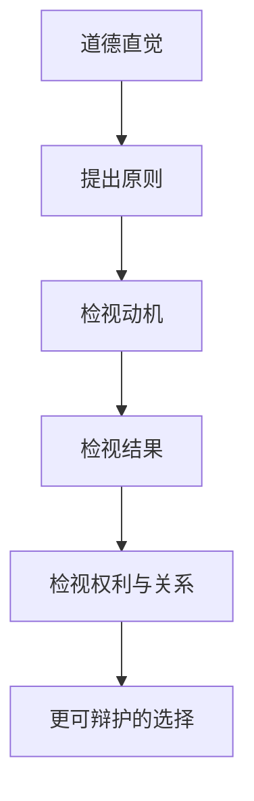

# 伦理学

## 定义

伦理学关注的是：我们应该做什么、为什么应该这样做，以及什么算是好的、正当的、可被辩护的行动。

## 一图速览

## 我的理解

伦理学最难的地方，不是背原则，而是现实中的原则经常彼此冲突。

比如：

- 自保和利他
- 结果和动机
- 权利和整体福祉
- 公平和仁慈

我会把伦理学理解成一种“让道德判断变得更自觉”的训练。

平时很多判断都来得很快：

- 这不对
- 这太自私了
- 这样做更好

但伦理学会逼我继续追问：

- 为什么不对
- 这里更看重结果还是原则
- 如果角色互换，我还坚持同样标准吗

## 价值

- 帮助我们不只凭情绪做判断
- 让道德直觉接受推敲
- 提醒我们别把他人只当成工具

## 为什么重要

- 它能帮助我区分“我不喜欢”和“这不正当”。
- 它让复杂处境中的选择更有自觉性。
- 它迫使人承认：道德判断并不总是轻松简单。

## 常见误区

- 把强烈情绪直接当成道德真理
- 只看结果，不看动机和手段
- 只讲原则，不看现实处境
- 只用一套标准判断别人，却放过自己

## 可直接抄用的自问

- 我现在更看重结果，还是更看重原则？
- 我有没有把别人只当成实现目的的手段？
- 如果我站在对方位置，还会认可这个判断吗？
- 这件事即使对我有利，它也站得住吗？

## 关联

- [[哲学入门课14天突破哲学大门-读书笔记]]
- [[利他]]
- [[敬天爱人]]
- [[生命的意义]]

## 一句话

伦理学不是替我做选择，而是让我更清楚自己为什么这样选。
