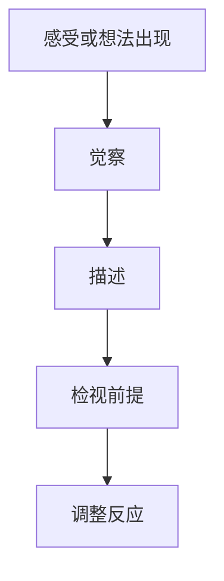

# 元认知

## 定义

元认知，就是对自己思考过程的觉察、理解与校正能力。

## 一图速览

## 我的理解

它让人不只是“在想”，而是能意识到“自己正在怎么想”。

区别在于：

- 没有元认知时，人容易被情绪、惯性和偏见直接带走。
- 有元认知时，人会先看到自己的反应，再决定是否跟随。

我会把元认知理解成“在自己和自己的反应之间，腾出一点空间”的能力。

这个空间很小，但特别关键。

没有这个空间时，人几乎是自动反应的：

- 情绪一来就冲出去
- 念头一出现就当成事实
- 习惯一启动就一路往下滑

有了这个空间，人就开始获得选择权。

## 元认知能带来什么

- 更清楚地识别情绪来源
- 更快发现自己的思维漏洞
- 更少被冲动决策牵着走
- 更容易做复盘和自我修正

## 为什么重要

- 它是很多成长能力的底层前提。
- 没有它，复盘容易流于表面。
- 没有它，学习容易变成信息堆积。
- 没有它，人会长期重复同一种失误模式。

## 常见误区

- 以为“我知道这个道理”就等于有元认知
- 复盘只看结果，不看思考路径
- 把强烈情绪直接当成客观现实
- 只观察别人，不观察自己

## 常见表现

### 元认知较弱时

- 遇事立刻反应
- 把问题都归因给外界
- 明明很忙，却不清楚自己为何低效
- 学了很多，却说不清自己真正懂了什么

### 元认知较强时

- 能描述自己当下的情绪和判断
- 能暂停一下再做决定
- 能复盘自己的失误模式
- 能逐步修正旧习惯

## 行动提醒

- 遇到强情绪时，先暂停，不急着反应。
- 经常问自己：我为什么会这样想？
- 复盘时不只看结果，也看思考路径。
- 训练把模糊感受说清楚。

## 可直接抄用的自问

- 我现在的情绪是什么？
- 这个判断是事实，还是解释？
- 我为什么会自然地往这个方向想？
- 如果不立刻反应，我还有没有别的选择？

## 关联

- [[认知红利-读书笔记]]
- [[认知红利-行动清单与金句摘录]]
- [[注意力]]
- [[复利]]
- [[结构化思维]]
- [[哲学思考]]

## 一句话

真正的成长，不只是获得新知识，而是开始看见并升级自己的思维方式。
