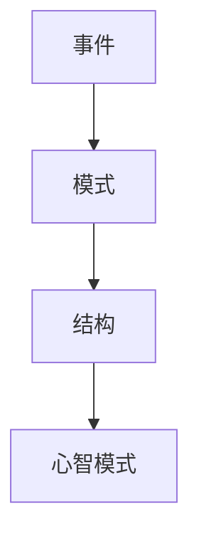

# 冰山模型

## 定义

冰山模型是一种系统思考框架，用来帮助人从表面事件，逐层深入到模式、结构和心智模式。

## 一图速览

## 四层

- 事件：发生了什么
- 模式：这种事是不是反复发生
- 结构：什么关系和机制在推动它
- 心智模式：什么信念和假设在支撑这种结构

## 我的理解

它最有价值的地方，是阻止我一看到问题就冲向表面答案。

冰山模型像一个强制减速器。它提醒我：

- 先别急着回应眼前这一幕
- 先看看这是不是经常发生
- 再看看是什么结构在不断制造它
- 最后追到最深处：我们到底默认相信了什么

## 为什么重要

- 它能避免人被事件层牵着走。
- 它能帮助我把“偶然”看成“模式”。
- 它会逼我从抱怨现象，走向理解机制。
- 它特别适合做复盘和问题定位。

## 适用场景

- 工作复盘
- 团队问题分析
- 关系冲突理解
- 个人习惯修正

## 常见误区

- 只停在事件层，以为已经分析了问题
- 把模式当原因，没有继续追结构
- 只谈结构，却不继续追问心智模式
- 一上来就追很深，反而忽略具体事实

## 可直接抄用的自问

- 这件事以前发生过吗？
- 它重复出现的模式是什么？
- 是什么结构让这个模式持续存在？
- 更深一层，大家默认相信了什么，才会维持这种结构？

## 关联

- [[如何系统思考-读书笔记]]
- [[因果回路图]]
- [[系统性思维]]

## 一句话

事件只是浮在水面上的那一小截，真正决定结果的东西往往藏在下面。
