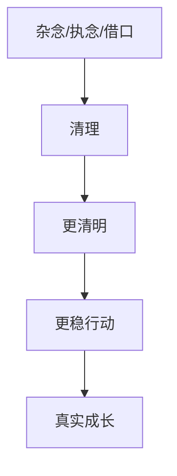

# 减法成长

## 定义

减法成长，是把成长理解为清理杂念、私欲、借口和失真反应，而不只是不断往自己身上叠加新知识、新方法和新标签。

## 一图速览

## 我的理解

我会把减法成长理解成一种“不是先加更多，而是先去掉拖住自己的东西”。

我们很容易把成长想成加法：

- 多学一点
- 多懂一点
- 多掌握几个方法
- 多拥有几套框架

这些当然重要，但《做人：王阳明心学的真正传习》提醒我，真正的卡点很多时候不是不知道，而是：

- 心里杂草太多
- 借口太多
- 比较心太重
- 太想证明自己
- 被恐惧和虚荣拖住

所以成长有时更像清障工程。不是继续堆，而是先把那些让判断失真、行动走形的东西一点点拿掉。

## 为什么重要

- 它能避免成长变成知识堆积。
- 它能让人看见自己的真正阻力往往在内部。
- 它能帮助行动恢复简洁和稳定。

### 它和“躺平式减少”完全不同

减法成长不是：

- 少做事
- 少负责
- 少努力

它真正减少的，是噪音、失真和自我消耗。

减少这些东西，不是降低标准，而是让真正重要的东西有空间长出来。

## 在这些书里的对应

- [[做人：王阳明心学的真正传习-读书笔记]]：把杂草清掉，让心更明，行动更正。
- [[认知红利-读书笔记]]：很多低质量忙碌，本质上也是注意力和目标被噪音占据。
- [[长期主义]]：长期积累不只靠增加投入，也靠减少无效消耗。

## 常见误区

- 把减法成长理解成少学习、少进步
- 只想快速断舍离，却不触及深层执念
- 看见问题后只自责，不真正清理结构性噪音
- 口头上说做减法，现实里却继续什么都舍不得放

## 行动提醒

- 先找出最近最耗心力的三种杂念，而不是盲目加新方法。
- 定期清理那些只是为了证明自己而做的事。
- 遇到长期卡顿时，先问“该减什么”，再问“该加什么”。

## 可直接抄用的自问

- 我最近最拖住自己的，不是不会，而是什么？
- 哪件事我明明知道没必要，却还是舍不得放？
- 我现在最该减少的是任务、欲望、解释，还是自我证明？
- 如果做一次真正的减法，哪部分行动反而会更稳？

## 关联

- [[做人：王阳明心学的真正传习-读书笔记]]
- [[长期主义]]
- [[注意力]]
- [[元认知]]

## 一句话

减法成长，不是让自己变少，而是把不该占据自己的东西慢慢拿掉。
