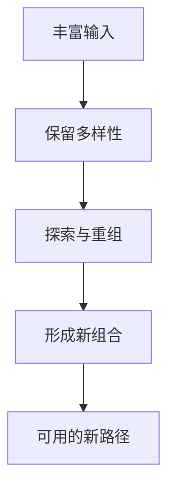

# 创造力

## 定义

创造力，不只是灵感爆发，而是能在旧元素之间建立新组合、在复杂景观中找到新路径的能力。

## 一图速览

## 我的理解

创造力往往不是“凭空想出”，而是：

- 输入足够丰富
- 保留多样性
- 允许探索和走神
- 敢于暂时离开原有最优路径

我越来越觉得，创造力更像一种系统条件，而不是某个神秘瞬间。

很多新想法之所以出现，不是因为人忽然天才附体，而是因为：

- 输入够杂
- 大脑里有足够多可重组材料
- 没有太早被单一标准压平
- 愿意允许一段时间的混乱和低效

## 在这些书里的对应

- [[如何解决复杂问题-读书笔记]]：创造力像进化，需要探索、重组和跳跃。
- [[认知红利-读书笔记]]：认知升级会改变你寻找机会和路径的方式。
- [[如何系统思考-读书笔记]]：看清结构，也会提高解决问题的创造性。

## 为什么重要

- 在复杂问题里，旧路径往往走不通。
- 创造力让人不只会沿着现有道路跑，而是能重新找路。
- 它既关乎艺术和表达，也关乎决策、组织和技术问题解决。

## 常见误区

- 把创造力等同于灵感闪现
- 只重视结果，不愿意提供探索空间
- 太早收敛，让所有想法都在幼苗阶段被掐掉
- 以为创造力只属于少数天才

## 行动提醒

- 不要过早收敛到唯一答案。
- 刻意增加跨领域输入。
- 给自己保留发散和试错的空间。

## 可直接抄用的自问

- 我最近的输入是不是过于单一了？
- 我有没有太早否定一个还不成熟的想法？
- 这件事如果换一个领域的人来做，会有什么不同做法？
- 我是在重复熟悉路径，还是在尝试新组合？

## 关联

- [[适合度景观]]
- [[遗传算法]]
- [[探索与优化]]
- [[认知红利-读书笔记]]

## 一句话

创造力，不只是想到新东西，更是敢于走出旧山头。
