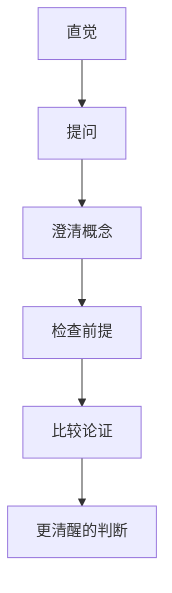

# 哲学思考

## 定义

哲学思考，是对那些看似理所当然的问题进行系统、清晰、持续追问的过程。

## 一图速览

## 我的理解

哲学思考不等于卖弄抽象词汇，而是愿意对以下几件事负责：

- 我在问什么
- 我默认了什么
- 我的推理是否成立
- 我的结论会把我带去哪里

我会把哲学思考理解成一种“不给自己的理所当然轻易通行证”的能力。

很多问题之所以一直含糊，不是因为没人说，而是因为大家默认：

- 这个词大家都懂
- 这个结论听起来顺
- 这个判断大多数人都接受

哲学思考会把这些默认全部重新摆上桌面。

## 常见问题

- 什么是对的
- 什么是真的
- 我是谁
- 世界是什么
- 生命为什么有意义

## 为什么重要

- 它能让人对概念更敏感。
- 它能提高判断时的诚实度。
- 它能训练人区分直觉、论证和结论。
- 它能让生活中的选择更自觉，而不是只跟着惯性走。

## 常见误区

- 把哲学思考当成空谈抽象
- 觉得有观点就等于有论证
- 只会质疑别人，不会检视自己的前提
- 急着站队，没先把问题问清

## 价值

- 让人从习惯性判断里退一步
- 提高概念清晰度
- 训练论证能力
- 让生活中的选择更自觉

## 可直接抄用的自问

- 我现在到底在讨论什么问题？
- 这个词在这里到底是什么意思？
- 这个结论真的被论证出来了吗？
- 如果把这个原则推到底，会出现什么后果？

## 关联

- [[哲学入门课14天突破哲学大门-读书笔记]]
- [[怀疑论]]
- [[伦理学]]
- [[结构化思维]]

## 一句话

哲学不是离生活很远，而是把生活里最根本的问题问得更深。
