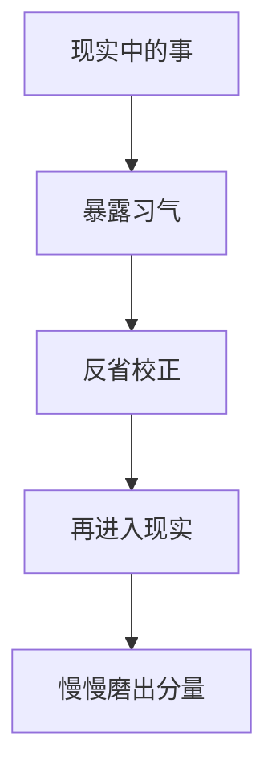

# 在事上磨

## 定义

在事上磨，就是不把修身、认知和成长停留在概念里，而是在具体工作、关系、困境和责任中反复练、反复照、反复校正。

## 一图速览

## 我的理解

我会把在事上磨理解成一种“不要等准备完再成长，而是在现实里边做边磨”的态度。

很多人容易把修养想成离开现场之后的事：

- 看完书再说
- 想明白再说
- 等环境好一点再说

但王阳明这一路最硬的地方，恰恰是它不允许人一直把修炼推迟。事情本身就是道场：

- 工作里的焦躁
- 关系里的委屈
- 冲突里的反应
- 困难里的选择

这些都在暴露一个人真实的水平。

所以“在事上磨”不是吃苦主义，也不是瞎扛，而是承认：

- 真功夫只能在现实摩擦里长出来
- 真判断必须经得起现实场景检验
- 真成长离不开一次次具体的修正

## 为什么重要

- 它能防止成长停在纸面和嘴上。
- 它能让人更快看见自己的习气和短板。
- 它能把知、行、心性和担当压成一体。

### 它和“忙很多事”不是一回事

不是所有忙碌都叫在事上磨。

真正的“磨”至少包含三步：

- 事情暴露了我
- 我看见了问题
- 我愿意在下一次具体改一点

没有这三步，忙碌只是重复消耗。

## 在这些书里的对应

- [[做人：王阳明心学的真正传习-读书笔记]]：它整本书都在把心学从概念拉回现实事务。
- [[知行合一]]：在事上磨几乎就是知行合一的现场版本。
- [[担当]]：很多担当不是想出来的，而是在事情里一点点扛出来的。
- [[格物致知]]：事情既是问题现场，也是照见自己和修正自己的现场。

## 常见误区

- 把在事上磨理解成被动忍耐
- 只在事情里受苦，不在事情里反省
- 把长期低效忙碌当成磨炼
- 一遇到现实摩擦就觉得不适合自己

## 行动提醒

- 每件让你特别不舒服的事，都值得问一句：它暴露了我什么？
- 做完事情后，花几分钟复盘下次具体改哪一点。
- 把现实中的摩擦，尽量转成下一轮更稳的动作，而不是转成抱怨。

## 可直接抄用的自问

- 这件事照出了我哪种习气？
- 我是在事情里成长，还是只是在事情里消耗？
- 下次遇到同类情境，我最具体能改的一步是什么？
- 我最不想碰的那类事情，是否正是我最该磨的地方？

## 关联

- [[做人：王阳明心学的真正传习-读书笔记]]
- [[知行合一]]
- [[担当]]
- [[格物致知]]

## 一句话

在事上磨，就是把现实当道场，而不是把现实当成成长开始前的干扰项。
