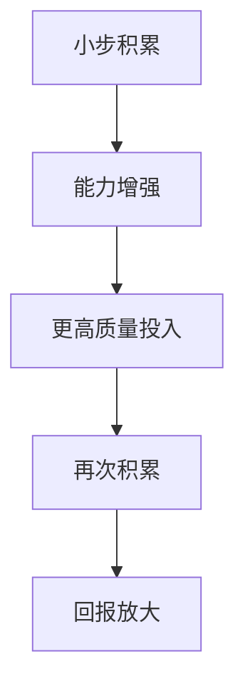

# 复利

## 定义

复利不只是金融概念，更是一种增长结构：前一次积累会增强后一次积累，结果在长期中不断放大。

## 一图速览

## 我的理解

复利的关键，不是“做很多”，而是“做的事情能彼此增益”。

比如：

- 读书积累为写作提供素材。
- 写作倒逼理解更清晰。
- 清晰理解又提升表达和判断。

如果这些环节能够互相加强，一个人的成长就不是加法，而会慢慢接近指数增长。

我觉得复利真正迷人的地方，不是“以后会很多”，而是“前面的积累会改变后面的积累质量”。

也就是说，复利不是简单重复，而是：

- 过去的投入，抬高了未来投入的效率
- 过去的成果，增强了后续行动的能力

所以它本质上是一种正反馈结构。

## 复利最难的地方

不是概念难，而是前期太安静。

很多事情在初期几乎看不到变化，所以人最容易在真正起势之前放弃。读书、锻炼、口碑、内容积累、能力建设，往往都要经过一段“地平线以下”的时期。

## 为什么人最容易错过复利

- 前期太安静
- 过程太重复
- 外界很少及时鼓励
- 短期替代品回报看起来更快

这意味着，错过复利的人往往不是没听过这个概念，而是没有熬过它沉默的前半程。

## 哪些事情值得做复利

- 阅读
- 写作
- 健康管理
- 能力训练
- 关系经营
- 个人品牌
- 知识库建设

## 常见误区

- 把一次性完成的事，当成复利积累
- 只想要结果，不接受前期沉默
- 今天做一点、明天断很久，无法形成连续增强
- 选择了很多事，却没有一件能真正被持续喂大

## 行动提醒

- 做能积累的事，不只做能完成的事。
- 给长期项目持续的小步投入。
- 不要因为短期没反馈，就误判长期价值。
- 经常问自己：这件事会不会在一年后放大回报。

## 可直接抄用的自问

- 我最近在持续喂大的，是哪一项资产？
- 哪些投入在彼此增强，哪些只是分散消耗？
- 我是不是因为短期看不到结果，就提前放弃了有复利价值的事？
- 如果一年后回看，哪件持续小事最可能让我感谢今天自己？

## 关联

- [[认知红利-读书笔记]]
- [[认知红利-行动清单与金句摘录]]
- [[注意力]]
- [[元认知]]
- [[长期主义]]

## 一句话

真正重要的成长，常常先沉默很久，然后突然开花。
