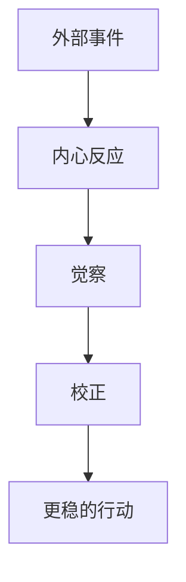

# 心上用功

## 定义

心上用功，是把修炼重点放在内心的觉察、校正与安顿上，不只处理外部事务，更处理自己面对事务时的心态、欲望、恐惧和执念。

## 一图速览

## 我的理解

我会把心上用功理解成一种“先不急着改世界，先看自己此刻是怎么被世界带走的”。

这不是逃避现实，也不是只做情绪安慰，而是承认：

- 同一件事，不同心态会做出完全不同的判断
- 很多问题看似发生在外面，真正失守却发生在里面
- 如果内心长期被恐惧、虚荣、比较心牵引，再好的方法最后也会走形

《做人：王阳明心学的真正传习》里“凡事要在心上下功夫”这层，我觉得几乎是全书的中轴。

它提醒我，很多时候真正需要处理的，不只是事件本身，而是：

- 我为什么这么急
- 我为什么这么怕
- 我为什么非要证明自己
- 我为什么总被同一种情绪带跑

## 为什么重要

- 心上用功能帮助我在复杂现实里不轻易失守。
- 它能降低情绪和执念对判断的污染。
- 它能让行动更稳，而不是被一时反应推着走。

### 它不是“只想不做”

真正的心上用功，最后一定会回到行动。

它不是把人变得更内耗，而是让行动前多一道内在校正：

- 先看清自己
- 再处理事情

这一步看似慢，实际常常更省代价。

## 在这些书里的对应

- [[做人：王阳明心学的真正传习-读书笔记]]：真正决定人是否能站住的，是胸中是否能立得住。
- [[活法-读书笔记]]：把修身、利他和日常工作打通，本质上也是一种持续的心性训练。
- [[认知红利-读书笔记]]：认知工具再多，如果注意力和心态失守，判断一样会变形。

## 常见误区

- 把心上用功理解成逃离现实
- 把一切问题都往“我想太多了”上归因
- 只做内心分析，不回到现实承担
- 把情绪压住误当成真的安定

## 行动提醒

- 情绪上来时先停一下，先分辨是本心还是执念在反应。
- 每次强烈纠结时，追问一句：我到底在怕什么、求什么、证明什么？
- 把每天一次短反省变成固定动作，而不是等出问题才看自己。

## 可直接抄用的自问

- 这件事真正让我乱的，是事情本身，还是我的执念？
- 我现在是在回应现实，还是在回应情绪？
- 哪种反复出现的情绪最容易把我带走？
- 如果先把心放稳，我会不会做出不同决定？

## 关联

- [[做人：王阳明心学的真正传习-读书笔记]]
- [[注意力]]
- [[元认知]]
- [[利他]]

## 一句话

心上用功，就是先把自己的心照亮一点，再去处理这个世界的复杂。
