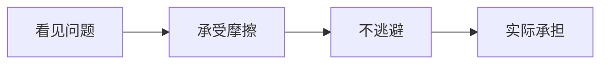

# 担当

## 定义

担当，不是情绪高涨时的豪言，而是在看清现实不完美之后，仍愿意留下来承担自己那一份责任。

## 一图速览

## 我的理解

我会把担当理解成一种“明知现实复杂，仍不轻易把责任甩出去”的力量。

很多人面对困难时，第一反应往往是：

- 解释为什么不是我的问题
- 批评环境为什么这么差
- 选择体面退出

这些反应不一定错，但《做人：王阳明心学的真正传习》最打动我的一句话，是：

- 拂袖而去很容易，难的是留下来。

这句话的分量在于，它把“担当”从表态拉回行动。

真正的担当不是姿态漂亮，而是：

- 已经受过委屈，还肯做该做的事
- 已经知道环境复杂，还不放弃正道
- 已经看见问题根深蒂固，还愿意先承担自己这一段

## 为什么重要

- 担当能把价值观从口头变成现实中的选择。
- 担当能防止人把聪明都用在自保上。
- 担当能让长期合作、长期建设真正发生。

### 它为什么比“会批评”更难

看出问题不算太难，指出问题也不算太难。

真正难的是：

- 我愿不愿意继续做
- 我愿不愿意承受代价
- 我愿不愿意在不完美里仍尽本分

所以担当不是认知优势，而是人格分量。

## 在这些书里的对应

- [[做人：王阳明心学的真正传习-读书笔记]]：担当是知行合一落到现实后的最后考验。
- [[活法-读书笔记]]：经营和做人都要把责任扛在自己身上，而不是先找借口。
- [[打胜仗的思想-读书笔记]]：真正的领导不是只会定调，而是能在复杂局面里承担。

## 常见误区

- 把一时热血当成长期担当
- 把硬扛一切误当成承担
- 只承担看得见的任务，不承担应该面对的关系和后果
- 只要求别人担当，自己先退到安全区

## 行动提醒

- 遇到问题时，先问自己这一段我该承担什么，而不是先找外部归因。
- 对该处理的关系、承诺和任务，减少拖延式逃避。
- 把“留下来做完”当成训练担当的最小动作。

## 可直接抄用的自问

- 我现在最想逃开的责任是什么？
- 我是在真正不该扛，还是只是怕麻烦、怕受伤、怕丢面子？
- 如果我选择留下来，我能先承担哪一步？
- 哪件事最能说明我最近是在表态，还是在担当？

## 关联

- [[做人：王阳明心学的真正传习-读书笔记]]
- [[知行合一]]
- [[利他]]
- [[打胜仗的思想-读书笔记]]

## 一句话

担当，就是在看清现实之后，仍愿意把自己该扛的那部分真正扛起来。
