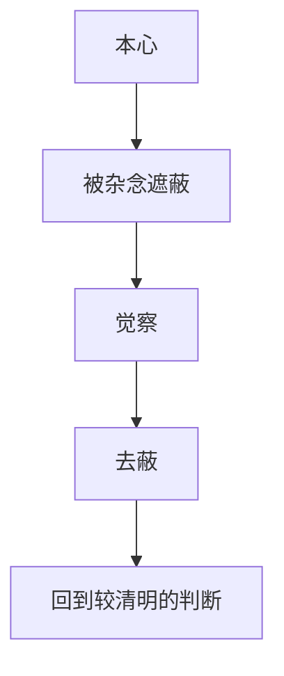

# 本心

## 定义

本心，可以理解为人内在较为清明、诚实、未被过多私欲和习气扭曲的那一层心。它不是情绪起伏本身，而是比一时情绪更深、更稳的内在基准。

## 一图速览

## 我的理解

我会把本心理解成一种“人没有被面子、恐惧、虚荣和算计带跑时，心里更真实的那个位置”。

它很容易被误会成：

- 一种浪漫直觉
- 一种只要跟着感觉走就行的状态

但在《做人：王阳明心学的真正传习》里，我读到的更像是：

- 本心不是任性
- 本心不是情绪
- 本心是经过反省后，仍能站得住的内在清明

所以本心不是用来替冲动背书的，而是用来对抗冲动、对抗习气、对抗自我欺骗的。

## 为什么重要

- 它让人有一个不完全被外部评价操控的判断基点。
- 它能帮助人在复杂局面里不轻易失守。
- 它是理解良知、修身和心上用功的起点。

### 它和“随心所欲”完全不同

随心所欲常常意味着：

- 我想怎样就怎样
- 我当下舒服最重要

本心恰好相反，它经常要求的是：

- 先把那些噪音拿掉
- 再看自己真正知道什么
- 再问这个判断是否经得起长期和现实

## 在这些书里的对应

- [[做人：王阳明心学的真正传习-读书笔记]]：`PDF p87` 那句“我们最不应该错过的，是我们自己的心”最适合放在这里一起理解。
- [[心上用功]]：心上用功本质上就是不断回到本心、看见偏差。
- [[致良知]]：良知要能显发，往往先要求本心不要被层层遮住。
- [[元认知]]：它们都在训练一种“看见自己”的能力，只是本心更偏价值与心性维度。

## 常见误区

- 把情绪强烈误当成本心真实
- 把任性包装成忠于自己
- 以为本心天然清楚，不需要反省
- 一遇到现实冲突，就彻底把本心让位给外部标准

## 行动提醒

- 情绪最满时，先别急着说“这就是我真实想法”。
- 对重大选择，留一点安静时间，看去掉面子和比较后自己还认不认可。
- 养成短反省习惯，让自己逐渐分得清本心和执念。

## 可直接抄用的自问

- 现在说话的是本心，还是受伤、虚荣、恐惧在说话？
- 如果不考虑面子，我真正知道什么？
- 如果不急着赢，我真正想守住什么？
- 哪些环境最容易让我离开本心？

## 关联

- [[做人：王阳明心学的真正传习-读书笔记]]
- [[心上用功]]
- [[致良知]]
- [[私欲]]

## 一句话

本心，不是任着感觉走，而是把那些会让自己失真的东西先挪开。
