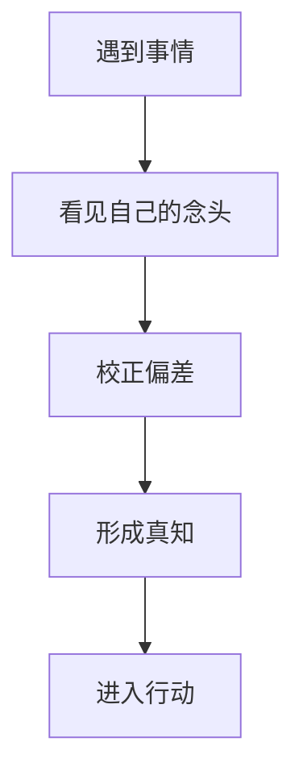

# 格物致知

## 定义

格物致知，原本是在问：人怎样通过面对事物、校正自己，获得真正的明白。放到王阳明这里，它不再主要是向外穷尽万物之理，而更强调在具体事情中反求诸心、校正念头、落实判断。

## 一图速览

## 我的理解

我会把格物致知理解成一种“不是把世界研究完，而是在具体事情里把自己弄明白”的工夫。

如果只按字面理解，它很容易被看成：

- 多读书
- 多研究
- 多知道外部规律

这些当然重要，但《做人：王阳明心学的真正传习》借王阳明和朱熹、陆九渊的差别，提醒我另一层更关键的事：

- 人不是只缺知识
- 人常常更缺的是在事情面前看见自己的偏、乱、私和执

所以格物致知并不只是“认识外物”，也是：

- 借事照心
- 在事上辨念
- 通过处理事情，逼自己更诚实

## 为什么重要

- 它能防止学习停留在纯概念层。
- 它能把“知道道理”和“面对事情的真实状态”接起来。
- 它能让认知训练回到生活现场，而不是飘在书页上。

### 它和一般意义上的“学习知识”有什么不同

一般学习常常是：

- 吸收信息
- 记住模型
- 理解解释

格物致知更进一步，它会追问：

- 这件事真的照见了什么？
- 我在这件事里到底错在哪里？
- 我面对现实的时候，有没有把知道活出来？

## 在这些书里的对应

- [[做人：王阳明心学的真正传习-读书笔记]]：`PDF p29` 最适合重读，这里最能看出“工夫收到心上”的关键转向。
- [[知行合一]]：格物致知如果不进入行动，就容易又回到概念层。
- [[元认知]]：它都强调先看见自己的思维和反应，而不是只看外部对象。

## 常见误区

- 把格物致知理解成只靠阅读积累
- 把它做成纯学术概念，不回到生活
- 只研究事情，不研究自己在事情里的偏差
- 以为知道解释就等于已经致知

## 行动提醒

- 每遇到一个卡点，除了分析问题，也问自己在这件事里被什么牵着走。
- 复盘时不只看结果，更看这件事照出了我什么习气和盲点。
- 把“事情是镜子”当成固定视角，而不是只把事情当障碍。

## 可直接抄用的自问

- 这件事真正要我看见的，除了外部问题，还有什么内在偏差？
- 我是在认真格物，还是只是在搜集说法？
- 哪个反复出现的失败，其实一直在提醒我同一个盲点？
- 如果把这件事当作修正自己的机会，我最该先改哪一点？

## 关联

- [[做人：王阳明心学的真正传习-读书笔记]]
- [[知行合一]]
- [[元认知]]
- [[在事上磨]]

## 一句话

格物致知，不只是把事情看懂，更是在事情里把自己照明白。
