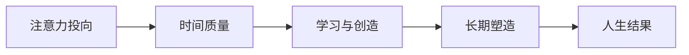

# 注意力

## 定义

注意力不是普通的心理资源，而是一个人最可主动支配、也最能持续创造价值的基础资源。

## 一图速览

## 我的理解

如果说时间是每个人都拥有的总量，那么注意力就是决定时间质量的密度。

同样是一小时：

- 有的人在分心、切换、刷信息。
- 有的人在深度思考、学习、创造、输出。

最后拉开差距的，不只是花了多久，而是注意力有没有真正投进去。

我越来越觉得，注意力像人生的方向盘。

时间是所有人都有的，但注意力决定了：

- 这段时间是被消耗了
- 还是被转化成了理解、产出和成长

所以注意力问题看起来像效率问题，本质上更像人生分配问题。

## 为什么重要

- 我把注意力投给什么，什么就会变强。
- 我长期关注什么，什么就会塑造我。
- 如果我不管理注意力，就一定有人替我分配它。

## 为什么它比时间管理更底层

很多人一提效率，先想到的是时间管理。但时间管理常常只处理“安排”，注意力管理处理的是“质量”。

即使同样安排了两小时：

- 一种是不断被切碎
- 一种是稳定深入

最后产出的差距会非常大。

## 常见误区

- 以为自己只是“休息一下”，其实在被无意识收割
- 觉得忙就是投入，实际上是频繁切换
- 对低价值信息持续上瘾，却误以为自己在获取资讯
- 没有主动设定重点，让外部环境替自己决定一天

## 常见的注意力流失

- 碎片化刷手机
- 情绪化浏览
- 对自己无关的信息过度投入
- 频繁切换任务
- 被外部通知牵着走

## 行动提醒

- 给重要任务留整块时间。
- 尽量减少无意识的信息摄入。
- 先决定今天最值得关注的事，再开始一天。
- 定期复盘：我今天把生命投给了什么。

## 可直接抄用的自问

- 我今天最清醒的一段时间给了什么？
- 我现在是在主动使用注意力，还是被外部牵走？
- 我最近持续关注的内容，正在把我塑造成什么样的人？
- 哪一种信息摄入最容易偷走我整天的专注力？

## 关联

- [[认知红利-读书笔记]]
- [[认知红利-行动清单与金句摘录]]
- [[复利]]
- [[元认知]]
- [[长期主义]]

## 一句话

注意力放在哪里，人生就会长成什么样子。
