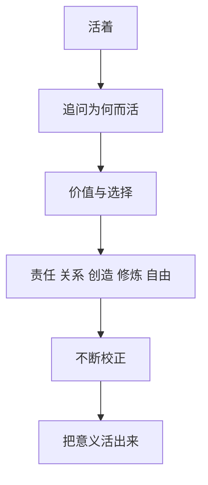

# 生命的意义

## 定义

生命的意义，不只是一个抽象提问，它关乎：人为什么活、怎样活，以及什么样的生活值得过。

## 一图速览

## 我的理解

这个问题之所以重要，不是因为它一定有统一答案，而是因为每个人都不可避免地在用某种方式回答它。

有的人用成就回答，有的人用关系回答，有的人用责任、创造、爱、修炼或自由回答。

我越来越觉得，生命的意义不是那种“想明白一次就永远结束”的问题。

它更像一个持续校正的问题：

- 我为什么想要现在追求的东西
- 我认为什么才算值得
- 我愿意为哪些价值付代价

所以它既不是空谈，也不是一次性标准答案。

## 在这些书里的对应

- [[哲学入门课14天突破哲学大门-读书笔记]]：意义本身就是哲学追问的终点之一。
- [[活法-读书笔记]]：人生意义在于磨炼灵魂。
- [[认知红利-读书笔记]]：意义与认知升级、人生主权有关。

## 为什么重要

- 它会决定一个人如何排序自己的时间与精力。
- 它会影响人面对痛苦、失败和选择时的解释方式。
- 它让“成功”这个词不只是外在结果，而开始和“值得”连接在一起。

## 常见误区

- 以为意义一定只有唯一答案
- 只在迷茫时才问，顺利时完全不问
- 把外界评价直接当成自己的人生意义
- 以为意义要靠想明白，其实更要靠活出来

## 行动提醒

- 不只问“我要什么”，也问“我为什么要这个”。
- 不只问“怎样成功”，也问“怎样活得值得”。
- 允许意义不是一次性确定，而是在生活中不断校正。

## 可直接抄用的自问

- 我现在最在乎的，到底是我自己真正在乎的，还是别人觉得我该在乎的？
- 如果把时间拉长十年，我今天的努力还值得吗？
- 我最愿意长期守住的价值是什么？
- 哪些选择会让我更接近“我认可的自己”？

## 关联

- [[活法-读书笔记]]
- [[长期主义]]
- [[哲学思考]]
- [[哲学入门课14天突破哲学大门-读书笔记]]

## 一句话

生命的意义，也许不是被找到的，而是在不断选择中被活出来的。
