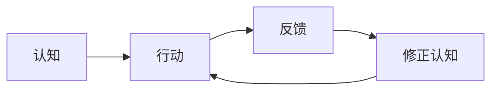

# 知行合一

## 定义

知行合一，不是“知道一点就去做一点”的口号，而是强调真正的知，必须能进入行动；如果行动始终没有跟上，那个“知”往往还不算真正落地。

## 一图速览

## 我的理解

我会把知行合一理解成一种“拒绝把懂了当成做到了”的清醒。

很多时候，人并不缺道理：

- 该运动知道
- 该复盘知道
- 该承担知道
- 该少被情绪牵着走也知道

真正稀缺的，是把这些知道变成动作、习惯和稳定反应。

《做人：王阳明心学的真正传习》让我很受触动的一点，就是它没有把知行合一写成抽象哲学，而是把它拉回工作、家庭、教育、处事这些很现实的地方。

所以知行合一不是“先有完整答案再行动”，而是：

- 在行动里检验自己是不是懂了
- 在反馈里修正自己理解错的地方
- 在持续练习里把认知磨成能力

## 为什么重要

- 它能防止人停留在概念满足感里。
- 它能把模糊理解转成可验证的行动。
- 它能让认知真正改变人的生活，而不是只改变表达。

### 它为什么常常比“多学一点”更重要

一个人如果一直在输入，却很少行动，就容易出现一种危险状态：

- 知识越来越多
- 行动力越来越弱
- 表达越来越顺
- 真实改变越来越少

知行合一的价值，就在于把这种虚胖纠正回来。

## 在这些书里的对应

- [[做人：王阳明心学的真正传习-读书笔记]]：真正的知，要在事上磨，在现实里见。
- [[认知红利-读书笔记]]：认知提升最终要体现在选择、行为和长期结果上。
- [[如何解决复杂问题-读书笔记]]：很多复杂问题不是继续想就能解，而是要靠试探、迭代和反馈推进。

## 常见误区

- 把“知道”误当成“掌握”
- 把行动等同于冲动执行
- 只做一次，就以为知行已经打通
- 遇到反馈不好就退回纯思考区

## 行动提醒

- 每学到一个判断，立刻找一个现实动作去验证。
- 少问“我懂了吗”，多问“我做了吗”。
- 把行动后的反馈写下来，让认知真正被校正。

## 可直接抄用的自问

- 我最近哪件事，是嘴上很懂、行动很弱？
- 我现在缺的是继续学，还是先去做？
- 如果我今天就要把这个认知落地，第一步是什么？
- 哪个反馈说明我其实还没真正懂？

## 关联

- [[做人：王阳明心学的真正传习-读书笔记]]
- [[结构化思维]]
- [[探索与优化]]
- [[做人：王阳明心学的真正传习-行动清单与金句摘录]]

## 一句话

知行合一，就是不让认知停在嘴上，而要让它进入手上、脚上和长期结果里。
