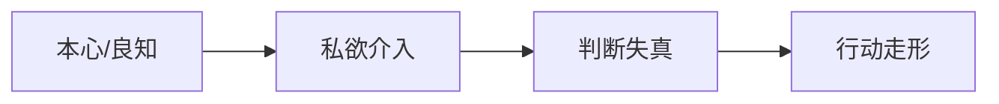

# 私欲

## 定义

私欲，不只是物欲，也包括那些让判断失真、让良知被遮住的自我中心牵引，比如面子、虚荣、控制欲、比较心、恐惧和过度自保。

## 一图速览

## 我的理解

我会把私欲理解成一种“把事情慢慢往‘只剩我自己’那边拽过去的力量”。

它最容易被狭义理解成贪财、贪色、贪名，但如果只这样看，就太浅了。《做人：王阳明心学的真正传习》让我更警惕的是那些更隐蔽的私欲：

- 非要证明自己
- 非要被别人认可
- 非要掌控局面
- 非要回避受伤
- 非要让自己显得正确

这些东西表面上不一定难看，甚至常常会伪装成：

- 上进
- 自尊
- 理性
- 保护自己

但它们一旦太重，人就会慢慢听不见更深层的是非判断。

## 为什么重要

- 私欲是很多认知失真的底层噪音来源。
- 它解释了为什么人并非不知道，而是常常不愿照着知道的去做。
- 它也是修身工夫里最需要长期清理的部分。

### 为什么它比“错误观念”更难处理

错误观念有时还可以靠解释纠正。

私欲更难，因为它常常和人的安全感、身份感、自我形象绑在一起，所以人会本能地替它辩护。

## 在这些书里的对应

- [[做人：王阳明心学的真正传习-读书笔记]]：`PDF p102` 对私欲、生死之念和念头滞留的讨论最值得反复看。
- [[减法成长]]：减法成长的核心，就是不断把这些遮蔽物拿掉。
- [[致良知]]：良知之所以难显，不常是因为没学，而常是因为私欲太重。
- [[心上用功]]：很多心上工夫，本质上就是识别私欲如何伪装。

## 常见误区

- 把私欲只理解成低级欲望
- 以为自己动机“看起来正当”就没有私欲
- 一边谈成长，一边不断喂养虚荣和比较心
- 看见私欲后只自责，不继续做具体清理

## 行动提醒

- 每当自己特别想证明、特别想赢、特别想解释时，先怀疑一下背后是不是私欲在发力。
- 复盘重大失误时，除了看能力问题，也看有没有面子、恐惧和控制欲介入。
- 不急着给自己洗白，先把真正的动机看清。

## 可直接抄用的自问

- 我现在到底在守原则，还是在守面子？
- 我这么坚持，是因为对，还是因为不甘心？
- 我最常被哪一种私欲牵着走？
- 如果把“非要证明自己”这层拿掉，我还会这样做吗？

## 关联

- [[做人：王阳明心学的真正传习-读书笔记]]
- [[减法成长]]
- [[致良知]]
- [[本心]]

## 一句话

私欲最危险的地方，不是它很明显，而是它常常伪装得像“理所当然的我”。
