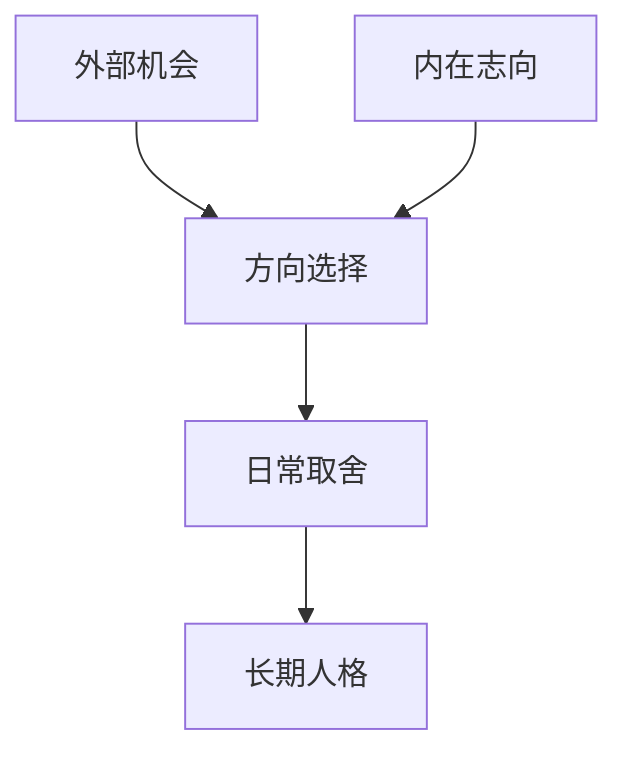

# 立志

## 定义

立志，不只是给自己设一个目标，而是先回答“我想成为什么样的人”，再由此决定自己怎么活、怎么做事、怎么取舍。

## 一图速览

## 我的理解

我会把立志理解成一种“先定人，再定事”的能力。

很多人一开始就忙着问：

- 我该找什么工作
- 我该选哪条路
- 我怎样更快成功

但立志会把问题往前推一步：

- 我到底想成为什么样的人
- 我愿意为了什么长期承担
- 哪些东西即使现实复杂，也不该轻易丢

《做人：王阳明心学的真正传习》里最打动我的一点，就是它不断把人从“求位置”拉回“先做人”。这其实就是立志的核心。

如果志向不清，人就很容易被短期利益、外界评价、环境压力牵着走；事情看起来做了很多，内在却越来越散。

## 为什么重要

- 立志让行动有主轴，而不是一直临时反应。
- 立志让人面对诱惑时更容易取舍。
- 立志让长期积累有方向，不只是机械努力。

### 它和目标有什么不同

目标更多是在回答“我要做到什么”。

立志更像在回答：

- 我为什么做
- 我靠什么做
- 做成之后我会变成什么样的人

所以目标可以阶段性调整，志向却更像整个人生的定盘星。

## 在这些书里的对应

- [[做人：王阳明心学的真正传习-读书笔记]]：先把“应成为什么样的人”想明白，再谈位置、收益和路径。
- [[活法-读书笔记]]：把人生的重心落在心性、利他与长期修炼上。
- [[认知红利-读书笔记]]：认知升级如果没有方向锚点，很容易滑向工具主义。

## 常见误区

- 把立志理解成喊口号
- 把短期野心误当成长远志向
- 志向说得很大，日常选择却完全不对应
- 一遇到现实摩擦，就把志向收回去

## 行动提醒

- 每周问一次：我最近的努力，更像在求位置，还是在扎实做人？
- 做重大选择时，先看这件事会把我塑造成什么样的人。
- 把志向落到日常习惯，不只停在自我感动里。

## 可直接抄用的自问

- 如果只保留一个最重要的方向，我想成为什么样的人？
- 我现在最在意的东西，是真志向，还是外界眼光？
- 我今天做的事，有多少在服务长期志向？
- 哪个选择正在悄悄把我带离我真正想成为的人？

## 关联

- [[做人：王阳明心学的真正传习-读书笔记]]
- [[长期主义]]
- [[生命的意义]]
- [[敬天爱人]]

## 一句话

立志，就是先把“我要成为什么样的人”定住，再让其他选择围着它转。
