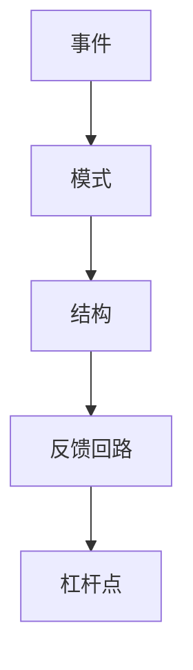

# 系统性思维

## 定义

系统性思维，就是不只看单一事件，而是把事物放进相互作用的整体中去理解。

## 一图速览

## 我的理解

很多问题之所以反复出现，不是因为表面处理得不够，而是因为背后的系统没有被看见。

比如一个结果，往往不是单点原因造成的，而是：

- 多个因素共同作用
- 各环节彼此影响
- 反馈回路不断强化

我会把系统性思维理解成一种“强迫自己多看两层”的能力。

大多数时候，人会自然停在事件层：

- 这次为什么出问题
- 这次是谁做错了
- 这次怎么马上补救

系统性思维则会继续追问：

- 这是不是已经发生过很多次
- 背后是什么结构让它反复发生
- 哪些因素在互相强化
- 我眼前看到的是结果，还是结果背后的机制

## 为什么重要

- 它能帮助我少做头痛医头、脚痛医脚的事。
- 它能让我看到问题背后的结构，而不只是表面现象。
- 它能让我理解，为什么有些解法短期有效、长期却会制造新问题。

### 它为什么比“更努力”更重要

很多人不是不努力，而是总在错误层次上努力。

如果一个问题本质上是结构问题，那么：

- 加更多任务，未必有用
- 开更多会，未必有用
- 更严的控制，甚至可能让事情更糟

系统性思维真正的价值，不是让人显得更高级，而是让人少在低效位置消耗。

## 常见误区

- 把复杂问题看成单点问题
- 只盯着表面结果，不看形成机制
- 解决一个局部，却破坏了整体

## 常见场景

- 团队问题总在重复出现
- 一项指标越救火越波动
- 关系冲突总是换个方式重演
- 学习和成长看起来很努力，却始终有卡点

## 它和结构化思维有什么不同

[[结构化思维]]更强调把混乱信息理清、分层、排序、表达出来。

系统性思维则更强调：

- 变量之间如何相互影响
- 问题如何动态变化
- 局部行为怎样影响整体

简单说：

- 结构化思维更像“把问题讲清楚”
- 系统性思维更像“把问题看完整”

## 行动提醒

- 问题出现时，先问系统里有哪些关键变量。
- 不只问“发生了什么”，还问“它为什么会不断发生”。
- 关注反馈关系：什么在强化它，什么在削弱它。

## 可直接抄用的自问

- 这是单次事件，还是重复模式？
- 哪几个变量在互相影响？
- 我现在是在改表面现象，还是改底层结构？
- 如果问题持续恶化，最可能是哪条反馈链在强化它？

## 关联

- [[认知红利-读书笔记]]
- [[结构化思维]]
- [[复利]]
- [[如何系统思考-读书笔记]]
- [[冰山模型]]
- [[因果回路图]]

## 一句话

看懂系统，才能不被现象牵着走。
