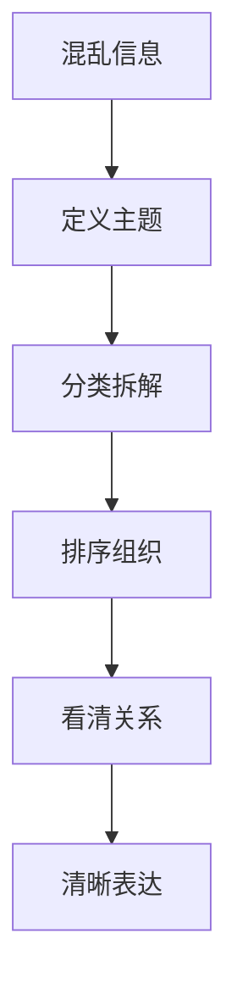

# 结构化思维

## 定义

结构化思维，就是把混乱的信息重新整理成有层次、有关系、可表达的结构。

## 一图速览

## 我的理解

很多人不是没想法，而是脑子里的东西堆在一起，没有被分层、分类和排序，所以一开口就乱，一动手就卡。

结构化思维的价值在于：

- 让问题变得可拆解
- 让表达变得更清楚
- 让行动更容易落地

我会把结构化思维理解成一种“先搭骨架，再长内容”的能力。

很多时候不是没内容，而是内容没有被整理：

- 哪些是并列关系
- 哪些是递进关系
- 哪些是因果关系
- 哪些其实重复了

一旦结构出来，很多表达和行动上的困难都会立刻下降。

## 常见场景

- 写笔记时不知从哪里下手
- 讲话时东一句西一句
- 分析问题时只看到局部
- 做方案时没有框架

## 为什么重要

- 它能降低表达成本。
- 它能减少思考时的混乱感。
- 它能让沟通对象更容易跟上。
- 它是很多复杂分析的入口能力。

## 常见误区

- 还没想清主题，就急着堆内容
- 拆得很多，却没有排序
- 结构表面很工整，实际没有逻辑关系
- 过度追求格式，忘了真正的问题是什么

## 基本做法

- 先定义主题：我到底在说什么问题
- 再做分类：这个问题能分成几部分
- 再排顺序：先讲什么，后讲什么
- 再看关系：这些部分是并列、递进还是因果

## 可直接抄用的检查清单

- 我现在讨论的核心主题到底是什么？
- 这些内容能不能拆成 3 到 5 个部分？
- 这些部分之间是什么关系？
- 有没有重复、混杂、跳跃？
- 如果我只给别人看提纲，对方能否看懂大意？

## 行动提醒

- 先列提纲，再展开内容。
- 先拆问题，再急着回答。
- 写完后回头检查：有没有重复、混杂、跳跃。

## 关联

- [[认知红利-读书笔记]]
- [[系统性思维]]
- [[元认知]]
- [[哲学思考]]
- [[如何系统思考-读书笔记]]

## 一句话

结构化思维，不是把内容变复杂，而是把复杂内容讲清楚。
