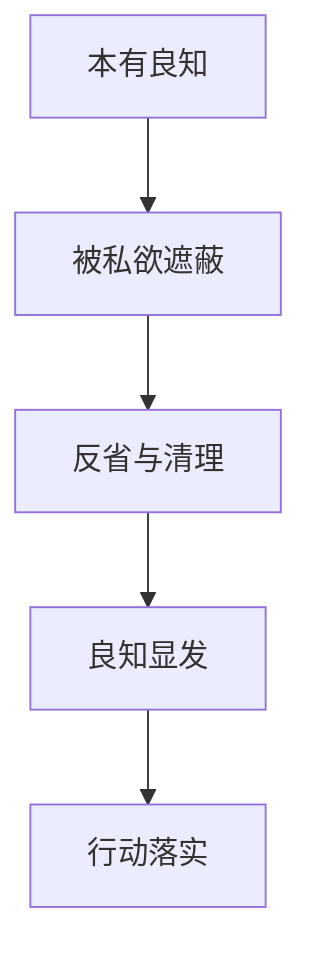

# 致良知

## 定义

致良知，就是让人内在本来知道是非善恶的那一点清明，不被私欲、恐惧、虚荣和习气遮住，并且把它真正落实到判断和行动中。

## 一图速览

## 我的理解

我会把致良知理解成一种“不是去发明善，而是把自己本来知道却常常做不到的善，重新活出来”。

它最有力量的一点，在于它并不把修身理解成单纯加法。很多时候，人不是完全不知道对错，而是：

- 知道，却不肯承认
- 承认，却不肯行动
- 行动时，又被别的欲望拖走

所以致良知不是一句温柔口号，而是很硬的要求：

- 要承认自己知道
- 要承认自己偏了
- 要承认真正难的是把知道守住

《做人：王阳明心学的真正传习》整本书都在往这一层压。它不是教人玩心学术语，而是不断逼问：你明明知道什么是该做的，为什么还是做不到？

## 为什么重要

- 它能把道德判断从外在规范拉回内在诚实。
- 它能让修身不只靠别人监督，而有自我校正能力。
- 它能解释很多人的痛苦为何不是无知，而是知而不行。

### 它和“做好人”有什么不同

“做好人”常常是一种外部形象。

致良知更严厉，因为它要求的是：

- 没人看见时你如何判断
- 利益冲突时你是否还承认对错
- 代价变大时你是否还肯照着良知走

## 在这些书里的对应

- [[做人：王阳明心学的真正传习-读书笔记]]：它几乎是全书的深层主轴，只是用更生活化的语言展开。
- [[本心]]：良知不是外加的，而是和本心的清明状态紧密相连。
- [[私欲]]：很多时候阻断良知的，不是没学过，而是私欲太重。
- [[知行合一]]：良知如果不能落实到行动，仍会停在“我知道”的幻觉里。

## 常见误区

- 把致良知理解成一种模糊善良
- 只在口头上承认良知，不在现实里承担代价
- 以为良知天然显现，不需要反省和磨炼
- 把自己的即时情绪误当成良知声音

## 行动提醒

- 每次做重大判断时，先问“我心里其实知道什么是对的”。
- 当内心很会找理由时，更要警惕自己是不是在替私欲辩护。
- 不把“我本来是好人”当安慰，而把“我有没有照着知道的去做”当检验。

## 可直接抄用的自问

- 我心里其实已经知道什么是对的，只是还不愿承认？
- 我现在的不行动，是因为不懂，还是因为不愿意付代价？
- 这件事里，我是在听良知，还是在给欲望找解释？
- 如果今天就按心里最清楚的那个判断去做，我会先改哪一步？

## 关联

- [[做人：王阳明心学的真正传习-读书笔记]]
- [[本心]]
- [[私欲]]
- [[知行合一]]

## 一句话

致良知，就是把自己本来知道的对，真正从心里护住，并在现实里做出来。
