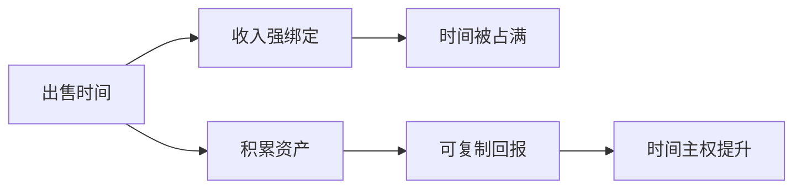

# 财富自由

## 定义

财富自由，不只是拥有很多钱，而是收入不再强依赖自己持续主动出售时间，也能覆盖生活所需，并保有对时间的主权。

## 一图速览

## 我的理解

这个定义比“赚很多钱”更有方向感。

因为只盯着钱，容易让人陷入焦虑和数字崇拜；但如果盯着“是否仍在零售自己的时间”，就会逼着自己重新思考收入结构和价值创造方式。

我会把财富自由理解成一种“时间结构的改变”。

它真正重要的，不只是账户里的数字变大，而是生活方式发生了变化：

- 有没有更多选择权
- 能不能不为了生存被迫交换全部时间
- 能不能把更多时间投给真正重要的事

## 和普通收入的区别

### 普通状态

- 必须持续工作
- 停下来，收入就明显下降
- 时间和收入强绑定

### 更自由的状态

- 收入部分来自可复制资产
- 过去的积累可以持续产生回报
- 时间不再完全被工作吞没

## 为什么很多人会误解它

常见误解有几种：

- 以为财富自由就是“赚特别多钱”
- 以为只有创业成功或暴富才有资格谈
- 以为财富自由意味着彻底不工作

其实更准确地说，它更像一个连续谱：

- 从完全卖时间
- 到一部分时间变成资产
- 再到收入越来越不依赖本人持续亲自出场

所以它不是非黑即白，而是一点点靠结构调整靠近的状态。

## 值得思考的问题

- 我现在是在卖时间，还是在积累资产？
- 我做的事情，未来能不能重复放大？
- 我有没有逐步提高单位时间的价值？

## 常见误区

- 只想增加收入，不想改变收入结构
- 只靠延长工作时间，而不提升单位价值
- 把高收入错当成高自由
- 忽视可沉淀资产建设，只追当下现金流

## 行动提醒

- 优先做能积累的事。
- 提升能力单价，而不只是延长工作时间。
- 尽可能建设可复制、可沉淀、可复用的成果。

## 可直接抄用的自问

- 我现在主要是在卖时间，还是在建资产？
- 哪件事如果我停下来一周，回报会立刻归零？
- 我最近做的哪些积累，有机会在未来重复放大？
- 我的时间主权，是在增加，还是在被继续透支？

## 关联

- [[认知红利-读书笔记]]
- [[注意力]]
- [[复利]]
- [[长期主义]]

## 一句话

财富自由的核心，不是钱更多，而是时间重新属于自己。
