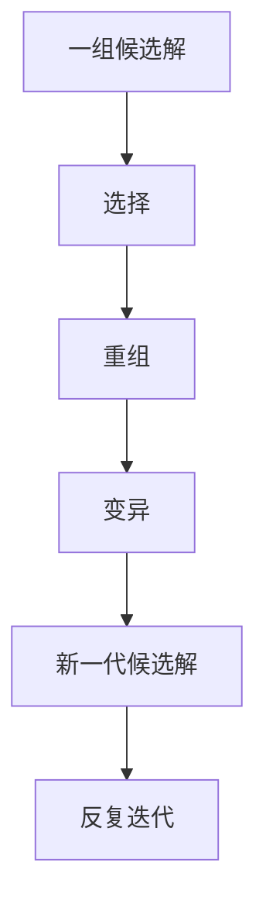

# 遗传算法

## 定义

遗传算法是一类模拟生物进化过程来搜索解空间的算法，核心机制包括选择、变异和重组。

## 一图速览

## 我的理解

它的价值不只是算得快，而是适合在复杂、崎岖、局部最优很多的问题里寻找更好的答案。

我会把遗传算法理解成一种“允许答案慢慢长出来”的方法。

它很反直觉的一点在于：

- 不要求一开始就知道最好答案
- 不指望单次聪明就解决问题
- 更相信一组方案在竞争、重组、试错中慢慢进化

这让它不仅是算法思想，也是一种解决复杂问题的思维模型。

## 关键启发

- 不必一开始就知道最优解。
- 先保留一组候选方案，让它们竞争、组合、迭代。
- 好答案常常不是直接推出来的，而是在多轮演化中冒出来的。

## 为什么重要

- 它提醒我复杂问题并不总适合“一次想清楚”。
- 它会自然鼓励多样性，而不是一开始就只押一个答案。
- 它很适合和创造力、探索、试错这些概念连起来看。

## 适用感受

它更像一种思维方式：

- 保留多样性
- 接受试错
- 允许重组
- 让答案逐步进化

## 常见误区

- 以为它只是技术算法，和现实思考无关
- 一开始就删到只剩一个方案，过早失去多样性
- 只做选择，不做变异和重组
- 期望它一次就给出完美答案

## 可直接抄用的自问

- 我现在是不是太早只押一个方案了？
- 我有没有保留足够多的候选路径？
- 这几个想法之间，有没有机会重组出新解？

## 关联

- [[如何解决复杂问题-读书笔记]]
- [[适合度景观]]
- [[创造力]]
- [[探索与优化]]

## 一句话

面对复杂问题，最好的答案有时不是设计出来的，而是演化出来的。
