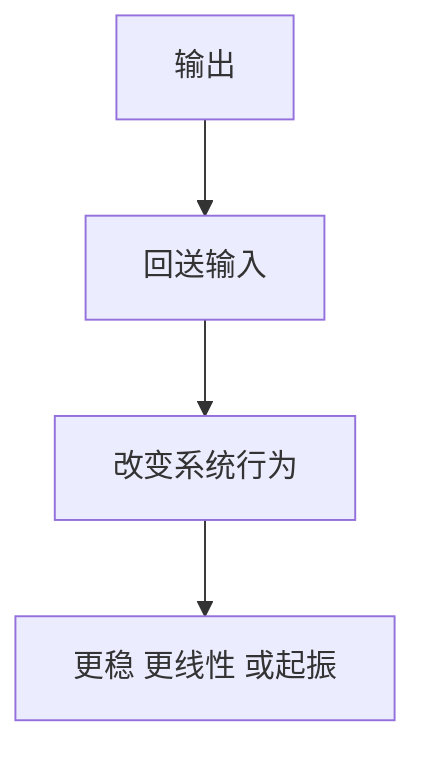

# 反馈

## 定义

反馈，就是把输出的一部分送回输入，借此改变电路的增益、稳定性、带宽、失真或工作状态。

## 一图速览

## 我的理解

反馈最有意思的地方在于，它不是一个附属技巧，而是电路行为的塑形器。

负反馈常常帮助系统更稳定、更线性、更可控；正反馈则可能用来形成比较器迟滞、振荡器等特殊功能。

也正因为反馈很强大，它也最容易制造误判：

- 纸面上公式成立，不代表实物中一定稳定
- 回路一旦被寄生参数影响，负反馈也可能变成麻烦的振荡源

我会把反馈理解成一种“系统自己影响自己”的机制。

它之所以重要，是因为它让系统不再只是被动响应，而是开始塑造自己的行为。

这也意味着：

- 好的反馈会让系统更稳
- 错的反馈会让系统更乱
- 看不见反馈，就很容易误判整个系统

## 为什么重要

- 没有反馈，很多高质量放大器根本不好用。
- 理解反馈，才能真正理解运放为什么“看起来简单却不总是听话”。
- 它也是把“单个器件能力”变成“系统行为”的关键桥梁。

## 常见误区

- 只会算反馈公式，不看真实回路
- 以为负反馈天然安全
- 忽视高频寄生参数对反馈的破坏
- 分析问题时只看局部器件，不看闭环行为

## 可直接抄用的自问

- 这里的反馈方向对吗？
- 这个回路在高频下还稳定吗？
- 问题出在器件本身，还是出在回路整体行为？

## 行动提醒

- 画电路时别只看元件连接，要主动识别反馈路径。
- 分析问题时同时问两件事：反馈方向对不对，反馈在高频下还稳不稳。
- 学会把反馈和带宽、相位裕度、布局放在一起看。

## 关联

- [[如何系统思考-读书笔记]]
- [[实例解读模拟电子技术完全学习与应用-读书笔记]]
- [[你好，放大器初识篇-读书笔记]]
- [[运算放大器]]
- [[放大器]]

## 一句话

反馈让电路从“能工作”走向“按预期工作”，也让工程师从接线走向设计。
