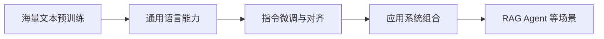

# 大语言模型

## 定义

大语言模型，是在海量文本上预训练、拥有强上下文建模能力和生成能力的神经网络模型，通常以 Transformer 架构为基础。

## 一图速览

## 我的理解

它和传统 NLP 模型最大的不同，不只是参数更大，而是学习范式变了：

- 先用海量无监督文本预训练
- 再通过指令微调、对齐和应用层组合进入具体任务

所以，大语言模型真正带来的，不只是一个更强的模型，而是一整套新的开发方式。

我会把大语言模型理解成一种“把语言能力变成底座能力”的技术。

过去很多 NLP 任务是一个任务配一个模型，一个任务配一套专门流程。

而 LLM 带来的变化是：

- 先训练一个通用底座
- 再通过提示、微调、检索、工具调用接入具体场景

这让开发逻辑从“针对任务造模型”，慢慢转向“围绕底座搭系统”。

## 为什么重要

- 它把很多原来要做专门建模和标注的任务，改成了提示、微调和系统组合问题。
- 它让“理解语言”和“生成语言”第一次以比较统一的方式落地。
- 它正在重塑知识工作、软件交互和内容生产。

## 常见误区

- 只把它看成更大的聊天模型
- 只追参数和榜单，不理解训练与应用链路
- 把“会回答”误当成“真正理解”
- 忽视 RAG、评测、工具接入等系统层工作

## 可直接抄用的自问

- 这个场景真正需要的是模型能力，还是系统组合能力？
- 我现在学的是模型表面功能，还是底层链路？
- 这项能力是靠预训练、微调，还是靠外部知识接入获得的？

## 行动提醒

- 学 LLM 时别只追模型榜单，先理解它的训练链路和能力边界。
- 不把“能回答”误当成“真正理解”。
- 同时关注预训练、微调、RAG、Agent 这些不同层次的问题。

## 关联

- [[Happy-LLM从零开始的大语言模型原理与实践教程-读书笔记]]
- [[Transformer]]
- [[技术学习阅读索引]]
- [[Happy-LLM从零开始的大语言模型原理与实践教程-行动清单与金句摘录]]

## 一句话

大语言模型不只是一个热门技术名词，而是一套新的智能构建方法。
