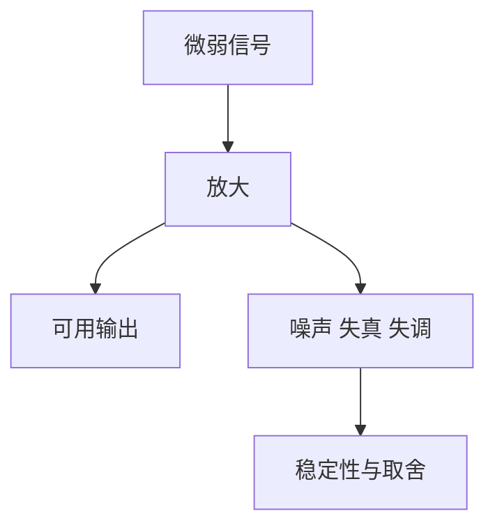

# 放大器

## 定义

放大器，是把微弱信号或功率提升到可用水平的器件或电路。

## 一图速览

## 我的理解

初学时很容易把“放大”理解成单纯把数值变大，但真正的放大器问题远不止增益。

我越来越感受到，放大器本质上是在做一件更难的事：

- 放大想要的部分
- 尽量不放大不想要的部分
- 在放大的同时维持稳定、线性和可控

所以，一个放大器好不好，不只看它能不能放大，还要看它会不会引入失调、噪声、失真、振荡和带宽损失。

我会把放大器理解成一个“把弱信号变得可用，但同时不断与副作用博弈”的系统。

这也是为什么它看起来简单，实际却特别能考验工程判断：

- 想放大更多，就可能更不稳
- 想带宽更大，就可能更难控噪
- 想更快更强，布局和负载就更敏感

## 为什么重要

- 很多传感器、电流检测、音频、电源控制和测量系统都绕不开它。
- 它是连接“弱信号”和“可处理信号”的桥梁。
- 它逼着我把器件选择、电路结构、供电和布局连起来看。

## 常见误区

- 只盯增益，不看噪声和稳定性
- 把“能放大”误解成“放大得好”
- 忽视输入输出条件与负载
- 只从理论图纸理解，不从真实系统理解

## 可直接抄用的自问

- 我到底要放大的是电压、电流还是功率？
- 这个设计里最容易出问题的是噪声、带宽、失真还是稳定性？
- 如果结果不对，是参数边界问题还是细节实现问题？

## 行动提醒

- 设计前先搞清楚自己要放大的到底是电压、电流还是功率。
- 选型时别只盯增益，连同噪声、带宽、输入输出范围、供电条件一起看。
- 电路出了问题时，先排查直流工作点、反馈路径、去耦和负载。

## 关联

- [[全彩图解电子工程师入门手册-读书笔记]]
- [[实例解读模拟电子技术完全学习与应用-读书笔记]]
- [[你好，放大器初识篇-读书笔记]]
- [[运算放大器]]
- [[反馈]]
- [[模拟电子技术]]

## 一句话

放大器不是“把信号变大”这么简单，它考验的是我能不能把放大这件事做得干净、稳定、可靠。
