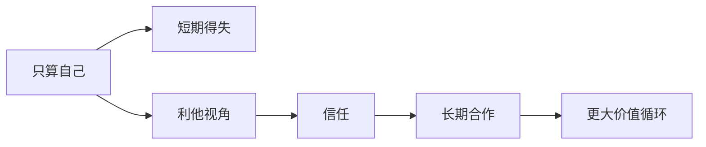

# 利他

## 定义

利他，不是单纯牺牲自己，而是在做判断和行动时，把他人的利益与整体价值放进考虑之中。

## 一图速览

## 我的理解

利他并不等于软弱。很多时候，它反而是一种更高水平的理性，因为它能建立信任、形成长期关系，并让合作持续发生。

我越来越觉得，利他真正厉害的地方，在于它不是一时的善意表现，而是一种更高级的关系逻辑。

如果一个人总只算自己，短期也许占到便宜，但长期很难形成稳定信任。

而利他让人开始考虑：

- 对别人是否有益
- 对整体是否有价值
- 这件事是否能让关系更持续

## 在现实中的表现

- 做事不只问“我得什么”，也问“别人得到什么”
- 不用短期算计破坏长期信用
- 把服务、成全、共赢当成正路

## 为什么重要

- 它让合作更可持续。
- 它让信用能不断积累。
- 它能把关系从交易层推进到信任层。
- 它会慢慢塑造一个人的气质与事业方式。

## 常见误区

- 把利他理解成没有边界的牺牲
- 把一味讨好误当成利他
- 只做表面善意，内里仍是纯算计
- 以为利他和效率、理性是对立的

## 可直接抄用的自问

- 我现在的选择，是否也在为别人创造价值？
- 这件事如果短期对我有利，但长期损伤信任，还值得做吗？
- 我是在真利他，还是在表演利他？

## 关联

- [[活法-读书笔记]]
- [[敬天爱人]]
- [[打胜仗的思想-读书笔记]]

## 一句话

利他不是吃亏，而是让价值循环起来。
