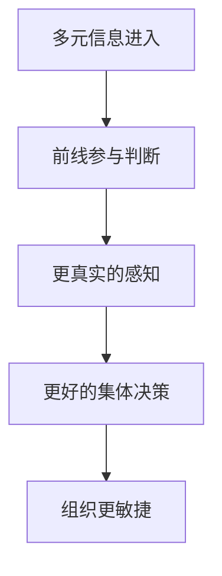

# 包容式领导

## 定义

包容式领导，不是“对所有人都温和”，而是在复杂环境中主动吸收多元信息、分散决策权、让前线参与叙事与判断的领导方式。

## 一图速览

## 我的理解

它和传统的强控制式领导最大的区别在于：

- 不假设高层总是最知道答案的人
- 不把一线成员只当执行螺丝钉
- 不把组织文化理解成单向灌输

真正的包容，不是气氛友好，而是让关键声音能进入决策，让组织在不确定中保持感知力和行动力。

我会把包容式领导理解成一种“扩大组织感知范围”的领导方式。

传统强控制式领导，常常默认：

- 高层知道最多
- 决策应尽量集中
- 异议会降低效率

而包容式领导恰恰反过来提醒：

- 真实信息可能在边缘
- 关键洞察常出现在前线
- 不同视角不是噪音，而是认知资源

## 为什么重要

- 复杂环境里，信息往往先出现在前线，而不是中心。
- 如果领导层只相信自己的叙事，组织很容易集体误判。
- 包容不是降低标准，而是提高组织的真实度和反应速度。

## 常见误区

- 把包容理解成一味温和
- 把谁都可以说话，误当成没有边界
- 只在形式上听意见，实际决策仍完全封闭
- 觉得异议一定会拖慢组织

## 可直接抄用的自问

- 我有没有真正听到前线看到的现实？
- 我是在吸收多元信息，还是只在寻找支持自己判断的证据？
- 组织里有没有安全空间让不同意见出现？

## 行动提醒

- 重要决策前，主动问一线成员看到了什么。
- 让讨论里允许不同意见，而不是只奖励“正确站队”。
- 领导者多定方向，少做过度控制。

## 关联

- [[打胜仗的思想-读书笔记]]
- [[红队思维]]
- [[系统性思维]]
- [[管理与商业阅读索引]]

## 一句话

包容式领导的本质，是让组织比领导者个人更聪明。
