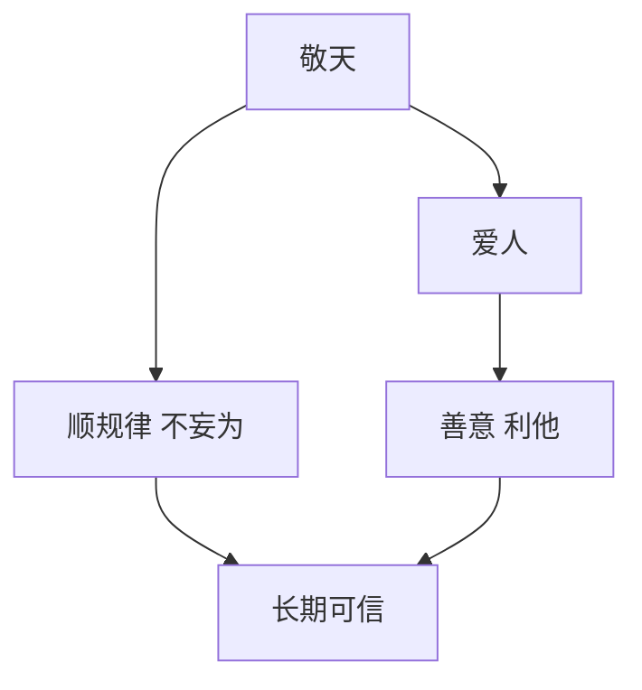

# 敬天爱人

## 定义

敬天爱人是稻盛和夫经营哲学中的核心表达，意思是敬畏规律、尊重天道，同时以善意和利他之心对待他人。

## 一图速览

## 我的理解

它既是道德要求，也是一种长期有效的处事逻辑。

- 敬天：承认规律，不自大，不妄为。
- 爱人：不只算自己的得失，也考虑他人的利益和整体福祉。

我会把它理解成两层同时成立的原则：

- 一层是面对世界时的谦卑
- 一层是面对他人时的善意

这两层少一层，都会让人走偏。

只有“敬天”没有“爱人”，容易变成冷硬的功利理性；
只有“爱人”没有“敬天”，又可能变成缺乏原则和边界的好心。

## 启发

- 动机比技巧更根本。
- 经营不是只看赢没赢，也看赢得正不正。
- 长期可信赖的成功，往往来自善意与正道。

## 为什么重要

- 它能把“做成事”和“做对事”放在一起看。
- 它让成功不只是结果问题，也变成路径问题。
- 它会逼着人反复检查自己的动机。

## 常见误区

- 只把它理解成一句道德口号
- 只讲善意，不讲规律
- 只讲规律，不讲对人的善待
- 在顺利时相信，在压力大时完全忘记

## 可直接抄用的自问

- 我现在的做法，是顺着规律，还是在和规律硬拗？
- 我现在的选择，是否兼顾了对他人的善意？
- 这件事即使做成了，我也会认可自己的动机和方式吗？

## 关联

- [[活法-读书笔记]]
- [[利他]]
- [[长期主义]]

## 一句话

真正稳的成功，既顺规律，也顾他人。
