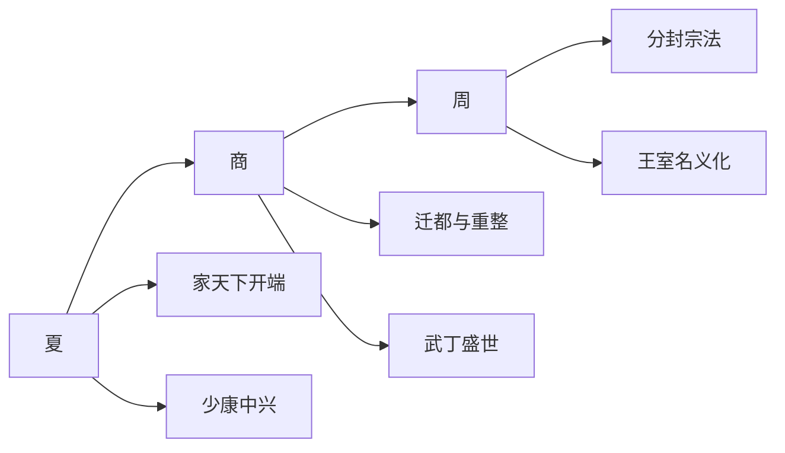

# 夏商周总览表

## 这张总览怎么用

这张表不是把三朝的帝王名单重新抄一遍，而是为了做横向比较。

真正要比较的，不只是“谁先谁后”，而是：

- 继承规则怎么形成
- 王权靠什么维持
- 危机在哪里暴露
- 修复靠什么完成
- 最后又是怎样失去天下

## 夏商周对照总图

## 夏商周核心对照表

| 维度 | 夏 | 商 | 周 |
|---|---|---|---|
| 政权起点 | 禹、启阶段完成从共主叙事到家天下转折 | 汤革命取代夏，建立新王朝 | 武王灭商后，以分封宗法重建天下秩序 |
| 王位继承主线 | 从禅让向父子继承过渡，规则尚不稳 | 早期有兄弟承继色彩，后逐步稳定 | 西周前期王统较稳，东周虽延续但实权大减 |
| 最关键的制度意义 | “家天下”成为核心继承逻辑 | 王权、祭祀、军事与都城系统更成熟 | 分封与宗法秩序最系统，后期却导致王室空心化 |
| 最值得看的中兴/修复节点 | 少康中兴 | 太戊中兴、祖乙回稳、盘庚迁殷、武丁盛世 | 宣王中兴、东迁后名义延续 |
| 最关键的权力转折 | 太康失国、少康复国 | 太甲被放、盘庚迁殷、武丁强盛 | 国人暴动、幽王之乱、平王东迁、三家分晋 |
| 王权靠什么维持 | 早期联盟、王统正当性、初步家天下秩序 | 王权与祭祀结合、迁都重整、军事征伐 | 宗法分封、礼制秩序、诸侯体系 |
| 关键支撑人物类型 | 奠基人物、复国辅助人物 | 伊尹式辅臣、傅说式贤相、妇好式军事人物 | 周公式摄政人物、召公等元勋、春秋霸主 |
| 典型危机表现 | 王统断裂、王权脆弱、后期失序 | 都城与秩序不稳、后期内外支持松动 | 王室衰弱、诸侯坐大、王命名义化 |
| 亡国方式 | 为商替代 | 为周替代 | 王统长期名存实亡，最终被战国强国体系吞没 |
| 最值得追问的问题 | 家天下为什么刚建立就这么脆弱 | 为什么商能比夏更成熟，又为何依然覆亡 | 为什么制度最完备的周，最后反而出现“天子尚在而天下不由天子” |

## 三朝并排看，最有价值的几个观察

### 1. 夏解决的是“谁来继承”的问题

夏最重要的历史意义，不在制度完备，而在于把王位继承从传说中的禅让逻辑，推向了家族继承逻辑。

所以它像是中国古代王朝秩序的起点。

### 2. 商解决的是“王权如何变强”的问题

商比夏更成熟，主要体现在：

- 王权更稳
- 都城重整能力更强
- 辅臣与王权关系更清楚
- 祭祀、军事和政治中心结合更紧

所以商像是一个更像样的早期王朝。

### 3. 周解决的是“天下如何系统治理”的问题

周最大的成就，不只是延续时间长，而是它把：

- 宗法
- 分封
- 礼制
- 王统

做成了一套能大规模治理天下的秩序框架。

但也正因为这套系统很大、很复杂，它后期的松动也更有代表性。

### 4. 三朝一起看，会发现“秩序复杂度”在上升

如果把夏商周连起来看，很清楚能看到一个趋势：

- 夏：先把继承规则立起来
- 商：把王权系统做强
- 周：把天下治理系统做大

也就是说，越往后，秩序越成熟，但维护成本也越高，失衡方式也越复杂。

### 5. 从夏到周，亡国越来越不像“单个坏君主”的故事

后世都喜欢把桀、纣、幽王这些人物道德化。

但如果把三朝并排看，会越来越清楚：

- 末主只是最后表层
- 真正决定命运的是王朝修复能力、替代力量是否成熟、以及旧秩序是否已经空掉

## 最适合一起看的配套页面

- [[夏朝帝系表]]
- [[商朝帝系表]]
- [[周朝帝系表]]
- [[王朝帝系与中枢大臣总索引]]
- [[王朝周期]]
- [[开国整合]]
- [[中兴]]
- [[制度弹性]]

## 一句话

夏商周总览最有价值的地方，不是把三朝排成时间顺序，而是让人看见中国早期王朝秩序是怎样从“建立继承”一步步走向“构造天下”，又怎样在复杂化中埋下新的脆弱性。
